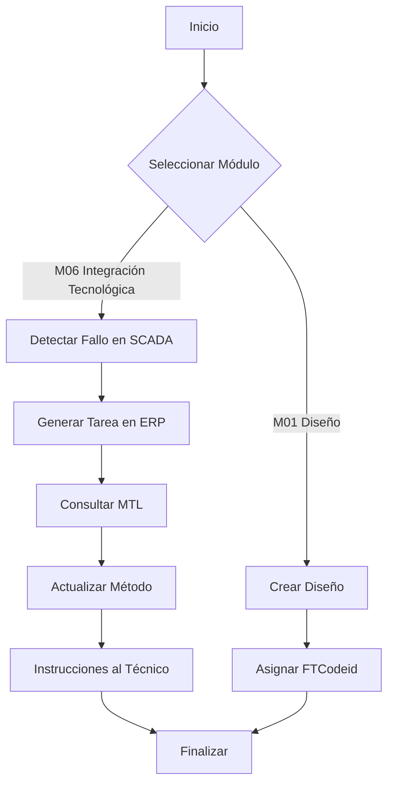

# FTCode (Functional Traceability Code) – Versión Final Integrada

El **FTCode** es un estándar funcional integral para GAIA AIR A360XWLRGA que proporciona trazabilidad, eficiencia, cumplimiento normativo, innovación tecnológica y sostenibilidad en todas las operaciones. Además, eleva la meta ambiental a la anulación completa de emisiones, superando la simple reducción, para alinear la organización con una aviación totalmente limpia y responsable.

## Resumen Ejecutivo

**Objetivo del FTCode:**  
Crear una estructura sistemática y modular que abarque el ciclo completo de vida de productos, procesos y sistemas, desde el diseño inicial hasta la mejora continua, integrando normativas (ISO, S1000D, ATA100, DO), tecnologías emergentes (IA/AGI, computación cuántica, blockchain, gemelos digitales), seguridad, sostenibilidad y metas de cero emisiones.

**Beneficios a Largo Plazo:**
- **Eficiencia Operativa:** Menos errores, mayor productividad, tiempos optimizados.
- **Costos Reducidos:** Mantenimiento predictivo, gestión proactiva de recursos.
- **Cero Emisiones:** Operaciones completamente limpias, sin impacto ambiental.
- **Innovación Continua:** Alineación con IA/AGI, computación cuántica, blockchain, gemelos digitales.
- **Cumplimiento Normativo:** Conformidad con normas internacionales (ISO, S1000D, ATA100, DO).
- **Mejora Continua:** Ajustes permanentes que optimizan la calidad, seguridad y sostenibilidad.

## Módulos del FTCode en Orden de Ciclo

El FTCode se organiza en módulos reflejando el ciclo de vida de los procesos y productos:

| ID   | Módulo                 | Descripción                                                                              |
|------|------------------------|------------------------------------------------------------------------------------------|
| M01  | Diseño                 | Desarrollo y gestión de diseños, asegurando calidad y conformidad.                       |
| M02  | Modelado               | Creación/gestión de modelos digitales y simulaciones para optimización previa a lo físico.|
| M03  | Gestión de Procesos    | Estandarización y optimización de procesos operativos/administrativos.                    |
| M04  | Gestión de Componentes | Administración, seguimiento y ciclo de vida de componentes físicos/digitales.             |
| M05  | Gestión de Datos       | Recolección, almacenamiento, análisis y trazabilidad de datos.                            |
| M06  | Integración Tecnológica| Interoperabilidad con IA/AGI, blockchain, computación cuántica, gemelos digitales, etc.   |
| M07  | Cumplimiento Normativo | Asegurar conformidad con normativas (ISO, S1000D, ATA100, DO).                           |
| M08  | Gestión de Seguridad   | Supervisión de seguridad, gestión de riesgos en sistemas y datos.                        |
| M09  | Sostenibilidad         | Monitoreo de indicadores, metas cero emisiones, gestión ambiental integral.               |
| M10  | Mejora Continua        | Iniciativas de optimización permanente en procesos, eficiencia y tecnologías.             |

## Terminología y Glosario Ampliado

Un **Glosario y Recursos Adicionales** en la intranet define:

- **Acrónimos:**
  - **IA:** Inteligencia Artificial
  - **AGI:** Inteligencia Artificial General
  - **QAOA:** Quantum Approximate Optimization Algorithm
  - **HPC:** High-Performance Computing
  - **AR/VR:** Realidad Aumentada/Realidad Virtual
  - **IoT:** Internet de las Cosas
  - **ESG:** Environmental, Social, and Governance
  - **STE:** Science, Technology, Engineering
  - **ATA:** Air Transport Association

- **Términos Técnicos:**
  - **Gemelos Digitales:** Réplicas digitales de entidades físicas para simulación y análisis.
  - **DfD:** Diseño para la Durabilidad.
  - **Computación Cuántica:** Área de la informática que utiliza principios de la mecánica cuántica.

- **Estándares:**
  - **S1000D:** Especificación internacional para documentación técnica.
  - **ATA100:** Especificación para documentación técnica en la aviación.
  - **ISO14001:** Gestión ambiental.
  - **DO-326A:** Normativa para seguridad en sistemas aeronáuticos.

- **MTL (Methods Token Library):** Biblioteca de métodos versionados integrable con ERP/MES/SCADA.

- **Metas Ambientales:** Cero Emisiones como objetivo clave.

Este glosario se actualiza continuamente, garantizando accesibilidad terminológica a todo el personal.

## Casos de Uso y Diagramas de Flujo

### Ejemplo M01 (Diseño):

- **Proceso:**
  1. Crear el diseño de un componente de propulsión cero emisiones.
  2. Asignar ID de Diseño, estado, responsable y fecha.
  3. **KPI:** Reducir el tiempo de aprobación del diseño en 15%.

### Ejemplo M06 (Integración Tecnológica) con MTL:

- **Proceso:**
  1. SCADA detecta fallo → ERP genera tarea.
  2. ERP consulta MTL para obtener método actualizado.
  3. Técnico recibe instrucciones correctas, cero errores, máxima eficacia.

### Diagrama de Flujo (Mermaid.js)



*Nota:* Asegúrate de que tu plataforma de documentación soporte Mermaid.js para renderizar correctamente el diagrama.

## Integración MTL con ERP/MES/SCADA

El **MTL** evita duplicaciones, actualizaciones manuales y errores. Los métodos se almacenan como tokens versionados:

- **Flujo de Integración:**
  - Actualizar el token en MTL → Actualizaciones automáticas en ERP/MES/SCADA.
  - Facilita mantenimiento predictivo, reduce tiempos y errores.

## Monitoreo y Evaluación Continua

**Calendario de Evaluaciones:**
- **Trimestral:** Revisión de KPIs de cada módulo, progreso hacia cero emisiones, adopción tecnológica.
- **Anual:** Revisión completa del FTCode, glosario, feedback interno.

**Comité de Revisión:**  
Representantes de M01 a M10 se reúnen mensualmente, reportan trimestralmente a la dirección, gestionan mejoras.

**KPIs Transversales:**
- Reducción de tiempos operativos.
- Cumplimiento normativo (100%).
- Avance hacia cero emisiones.
- Adopción tecnológica (IA/AGI, cuántica).
- Número de iniciativas de mejora completadas.

## Expansión del Glosario

Glosario ampliado con definiciones detalladas de términos clave, acrónimos y estándares. Asegura comprensión universal, independientemente del nivel técnico del usuario.

## Comentarios por Sección

- **FTCode:** Estructura en orden de ciclo → Comprensión secuencial lógica. KPIs por módulo → Ajustes basados en métricas.
- **GAIA DS:** GAIA DS es un marco sostenible, multidimensional, integrando metas ecológicas, sociales, económicas y técnicas. El FTCode se alinea con GAIA DS, impulsando una operación cero emisiones.
- **MTL (Methods Token Library):**  
  Control de versiones, estandarización, actualizaciones automáticas. Integración con S1000D y ATA refuerza la alineación con estándares industriales.

## Plantilla Inicial (Markdown)

Esta plantilla puede utilizarse como base para documentar cada elemento del inventario. El objetivo es mantener la coherencia y asegurar que todos los datos relevantes se registren de manera uniforme.

```markdown
# [NOMBRE DEL ELEMENTO]

## Identificación y Clasificación

- **TECHNOLOGY:** [Nombre de la tecnología base]
- **COMPONENT:** [Nombre del componente]
- **SYSTEM or ENTITY:** [Nombre del sistema o entidad]
- **FTCodeid:** [Código funcional/trazabilidad, ej. FT-PROP-045]
- **KLUSTER:** [Nombre del KLUSTER, ej. KLUSTER-PROPULSION]
- **ECOSYSTEM:** [Nombre del ecosistema, ej. ECOSYSTEM-GAIA]
- **MODEL/Version:** [Versión del componente/sistema, ej. MODEL-3.2]

## Descripción

Proporcionar una descripción detallada del elemento, incluyendo su propósito, funcionalidades clave, y relevancia dentro del sistema o ecosistema.

- **Propósito:** Explicar por qué existe este elemento, cuál es su rol dentro del ecosistema.
- **Características Principales:** Listar las funciones o atributos más relevantes del componente/sistema.
- **Metas Ambientales:** Indicar cómo este elemento contribuye a la meta de cero emisiones o a la sostenibilidad del ecosistema.

## Integración con Otros Sistemas y Herramientas

- **Integración con MTL:** Explicar si este elemento hace referencia a algún método o procedimiento tokenizado en MTL y cómo.
- **ERP/MES/SCADA:** Detallar cómo se integra con estos sistemas, qué datos intercambia y qué procesos habilita.
- **Tecnologías Emergentes (IA/AGI, Cuántica, Blockchain):** Indicar si el elemento aprovecha IA para mantenimiento predictivo, computación cuántica para optimización, blockchain para trazabilidad, etc.

## Ciclo de Vida y Trazabilidad (FTCodeid)

- **Origen del Componente:** Describir de dónde proviene el componente (proveedor, fabricación interna, etc.).
- **Historial de Cambios:** Registrar actualizaciones, modificaciones o reemplazos.
- **Documentación Asociada:** Enlaces o referencias a manuales, instrucciones (S1000D), normativas aplicables (ATA, ISO).

## Métricas y KPIs

- **KPIs Definidos:** Listar los indicadores clave de desempeño relacionados con este elemento (tiempos de operación, eficiencia energética, reducción de emisiones).
- **Frecuencia de Medición:** Indicar cada cuánto se revisan los KPIs.
- **Resultados Actuales:** Registrar valores más recientes, tendencias o logros.

## Riesgos y Estrategias de Mitigación

- **Riesgos Potenciales:** Identificar posibles riesgos (fallos técnicos, dependencia de un proveedor, vulnerabilidades de seguridad).
- **Estrategias de Mitigación:** Señalar medidas tomadas o previstas para reducir dichos riesgos.

## Responsabilidades y Contactos

- **Responsable Interno:** Nombre del equipo o persona encargada de la gestión de este elemento.
- **Contactos Externos (si aplica):** Proveedores, consultores, socios tecnológicos.

## Próximos Pasos

- **Actualizaciones Pendientes:** Señalar mejoras planificadas, nuevas versiones, integraciones adicionales.
- **Fechas Clave:** Próxima revisión trimestral, auditorías, metas de reducción de emisiones.
```

### Adaptaciones y Profundización

Esta plantilla puede adaptarse según las necesidades del proyecto, agregando o removiendo secciones de acuerdo con el nivel de detalle requerido.

## Profundización en Pasos Específicos

1. **Creación de Plantillas:**  
   Además de la plantilla inicial, se pueden generar plantillas especializadas para cada módulo (M01 a M10). Por ejemplo:
   - **Plantilla M01 (Diseño):** Incluir campos específicos sobre fases de diseño, software CAD utilizado, validaciones requeridas.
   - **Plantilla M09 (Sostenibilidad):** Añadir secciones para metas ESG, indicadores de emisiones y planes de acción.

2. **Capacitación:**  
   - Desarrollar cursos cortos en línea (microlearning) para explicar la estructura, la lógica del FTCode y el uso del MTL.
   - Organizar talleres prácticos donde los equipos documenten un ejemplo real siguiendo la plantilla, para afianzar el aprendizaje.

3. **Integración Digital (Herramientas):**  
   - Evaluar el uso de una plataforma de gestión de la información (Confluence, SharePoint) para centralizar la documentación.
   - Implementar un CMS o base de datos interna donde cada registro del FTCode se almacene en formato markdown, permitiendo búsqueda, versionado y control de cambios.
   - Integración con APIs para que ERP/MES/SCADA consulten los tokens del MTL en tiempo real.

4. **Revisión Continua:**  
   - Definir responsables de auditorías internas trimestrales para verificar si la documentación se sigue la plantilla.
   - Establecer un tablero de KPIs que muestre en tiempo real el estado de cumplimiento, los avances en cero emisiones, adopción de tecnologías y logros en mejora continua.
   - Mantener sesiones de feedback con los usuarios finales (técnicos, ingenieros, analistas) para ajustar la plantilla o la jerarquía cuando se detecten dificultades prácticas.

---

## Plantilla Inicial de Documentación

A continuación se presenta una propuesta de **plantilla inicial** en formato Markdown para documentar los elementos según la estructura jerárquica definida.

```markdown
# [NOMBRE DEL ELEMENTO]

## Identificación y Clasificación

- **TECHNOLOGY:** [Nombre de la tecnología base]
- **COMPONENT:** [Nombre del componente]
- **SYSTEM or ENTITY:** [Nombre del sistema o entidad]
- **FTCodeid:** [Código funcional/trazabilidad, ej. FT-PROP-045]
- **KLUSTER:** [Nombre del KLUSTER, ej. KLUSTER-PROPULSION]
- **ECOSYSTEM:** [Nombre del ecosistema, ej. ECOSYSTEM-GAIA]
- **MODEL/Version:** [Versión del componente/sistema, ej. MODEL-3.2]

## Descripción

Proporcionar una descripción detallada del elemento, incluyendo su propósito, funcionalidades clave, y relevancia dentro del sistema o ecosistema.

- **Propósito:** Explicar por qué existe este elemento, cuál es su rol dentro del ecosistema.
- **Características Principales:** Listar las funciones o atributos más relevantes del componente/sistema.
- **Metas Ambientales:** Indicar cómo este elemento contribuye a la meta de cero emisiones o a la sostenibilidad del ecosistema.

## Integración con Otros Sistemas y Herramientas

- **Integración con MTL:** Explicar si este elemento hace referencia a algún método o procedimiento tokenizado en MTL y cómo.
- **ERP/MES/SCADA:** Detallar cómo se integra con estos sistemas, qué datos intercambia y qué procesos habilita.
- **Tecnologías Emergentes (IA/AGI, Cuántica, Blockchain):** Indicar si el elemento aprovecha IA para mantenimiento predictivo, computación cuántica para optimización, blockchain para trazabilidad, etc.

## Ciclo de Vida y Trazabilidad (FTCodeid)

- **Origen del Componente:** Describir de dónde proviene el componente (proveedor, fabricación interna, etc.).
- **Historial de Cambios:** Registrar actualizaciones, modificaciones o reemplazos.
- **Documentación Asociada:** Enlaces o referencias a manuales, instrucciones (S1000D), normativas aplicables (ATA, ISO).

## Métricas y KPIs

- **KPIs Definidos:** Listar los indicadores clave de desempeño relacionados con este elemento (tiempos de operación, eficiencia energética, reducción de emisiones).
- **Frecuencia de Medición:** Indicar cada cuánto se revisan los KPIs.
- **Resultados Actuales:** Registrar valores más recientes, tendencias o logros.

## Riesgos y Estrategias de Mitigación

- **Riesgos Potenciales:** Identificar posibles riesgos (fallos técnicos, dependencia de un proveedor, vulnerabilidades de seguridad).
- **Estrategias de Mitigación:** Señalar medidas tomadas o previstas para reducir dichos riesgos.

## Responsabilidades y Contactos

- **Responsable Interno:** Nombre del equipo o persona encargada de la gestión de este elemento.
- **Contactos Externos (si aplica):** Proveedores, consultores, socios tecnológicos.

## Próximos Pasos

- **Actualizaciones Pendientes:** Señalar mejoras planificadas, nuevas versiones, integraciones adicionales.
- **Fechas Clave:** Próxima revisión trimestral, auditorías, metas de reducción de emisiones.
```

Esta plantilla puede adaptarse según las necesidades del proyecto, agregando o removiendo secciones de acuerdo con el nivel de detalle requerido.

---

## Ejemplos Prácticos para los Módulos y Tokens de la MTL

### Ejemplo de Documentación para el Módulo M01 (Diseño)

```markdown
# Diseño de Componente de Propulsión Cero Emisiones

## Identificación y Clasificación

- **TECHNOLOGY:** Propulsión Sostenible
- **COMPONENT:** Cámara de Combustión Dinámica
- **SYSTEM or ENTITY:** DIFFUSPropulsion
- **FTCodeid:** FT-PROP-045
- **KLUSTER:** KLUSTER-PROPULSION
- **ECOSYSTEM:** ECOSYSTEM-GAIA
- **MODEL/Version:** MODEL-3.2

## Descripción

- **Propósito:**  
  Desarrollar una cámara de combustión eficiente que reduzca las emisiones a cero, mejorando la sostenibilidad del sistema de propulsión.

- **Características Principales:**  
  - Alta eficiencia energética
  - Materiales avanzados resistentes a altas temperaturas
  - Integración con sistemas de monitoreo en tiempo real

- **Metas Ambientales:**  
  Contribuir a la meta de cero emisiones mediante el uso de tecnologías limpias y materiales sostenibles.

## Integración con Otros Sistemas y Herramientas

- **Integración con MTL:**  
  Este componente utiliza métodos tokenizados en la MTL para su mantenimiento predictivo.

- **ERP/MES/SCADA:**  
  Se integra con el sistema SCADA para monitoreo en tiempo real y con ERP para la gestión de inventarios.

- **Tecnologías Emergentes (IA/AGI, Cuántica, Blockchain):**  
  Utiliza IA para optimizar el rendimiento y blockchain para asegurar la trazabilidad de los componentes.

## Ciclo de Vida y Trazabilidad (FTCodeid)

- **Origen del Componente:**  
  Fabricación interna en las instalaciones de GAIA AIR.

- **Historial de Cambios:**  
  - **v1.0:** Diseño inicial.
  - **v2.0:** Mejora en materiales para mayor durabilidad.
  - **v3.2:** Integración con sistemas de monitoreo en tiempo real.

- **Documentación Asociada:**  
  - [Manual de Usuario S1000D](https://example.com/manual-s1000d)
  - [Normativa ATA100](https://example.com/normativa-ata100)

## Métricas y KPIs

- **KPIs Definidos:**  
  - Tiempo de operación sin fallos
  - Eficiencia energética (%)
  - Reducción de emisiones (kg CO₂)

- **Frecuencia de Medición:**  
  - Mensual

- **Resultados Actuales:**  
  - Tiempo de operación: 1200 horas sin fallos
  - Eficiencia energética: 95%
  - Reducción de emisiones: 0 kg CO₂

## Riesgos y Estrategias de Mitigación

- **Riesgos Potenciales:**  
  - Fallos en materiales avanzados
  - Dependencia de proveedores específicos

- **Estrategias de Mitigación:**  
  - Realizar pruebas exhaustivas de materiales
  - Diversificar proveedores para componentes críticos

## Responsabilidades y Contactos

- **Responsable Interno:** Equipo de Diseño de Propulsión
- **Contactos Externos (si aplica):** Proveedor de Materiales Avanzados XYZ

## Próximos Pasos

- **Actualizaciones Pendientes:**  
  - Implementar mejoras en la eficiencia energética en la versión 4.0

- **Fechas Clave:**  
  - Próxima revisión trimestral: 20/03/2024
  - Auditoría de sostenibilidad: 15/06/2024
```

### Ejemplo de Token en la MTL para el Módulo M06 (Integración Tecnológica)

```json
{
  "FTCodeid": "FT-INTEG-102",
  "module": "M06 Integración Tecnológica",
  "method": "Actualización Automática de Métodos",
  "description": "Método para actualizar automáticamente los métodos en el ERP/MES/SCADA desde la MTL.",
  "version": "v1.2",
  "dependencies": ["ERP System", "MES Platform", "SCADA Interface"],
  "last_updated": "2024-01-15",
  "owner": "Equipo de Integración Tecnológica",
  "documentation": "https://example.com/mtl-ft-integ-102"
}
```

---

## Conclusión Final

Esta versión final del FTCode, organizada y mejorada, está lista para su lanzamiento ("released"). Ofrece un marco robusto para la trazabilidad completa, la adopción de tecnologías emergentes, el cumplimiento normativo, la seguridad, la sostenibilidad y la meta de cero emisiones. Con capacitación adecuada, herramientas digitales, monitoreo continuo y auditorías, el FTCode asegura eficiencia, reducción de costos y liderazgo en innovación aeronáutica sostenible.

**From these Freudian depths, GAIA DS emerges.**  
Este poético epílogo subraya la complejidad conceptual y la ambición del marco GAIA DS y el FTCode, anclados en la búsqueda de excelencia, innovación y sustentabilidad total.

**Procedo al Released:**  
Con este README, el FTCode se publica en `Breadcrumbs-Robbbo-T-.github.io / main`, marcando el inicio de su adopción progresiva y el camino hacia una operación aeroespacial completamente limpia, eficiente, segura, innovadora y alineada con el futuro.

---

## Glosario Detallado

| Término                   | Definición                                                                                                                                               | Ejemplo / Enlace                                       |
|---------------------------|----------------------------------------------------------------------------------------------------------------------------------------------------------|--------------------------------------------------------|
| **FTCodeid**              | Código único que asocia la funcionalidad o trazabilidad del elemento en el ecosistema.                                                                  | FT-PROP-045                                            |
| **KLUSTER**               | Conjunto lógico de sistemas o componentes agrupados según su función o propósito específico.                                                           | KLUSTER-PROPULSION                                     |
| **ECOSYSTEM**             | Red completa de tecnologías, componentes y sistemas dentro de un entorno funcional.                                                                      | ECOSYSTEM-GAIA                                         |
| **MTL (Methods Token Library)** | Biblioteca de métodos versionados integrable con ERP/MES/SCADA, que facilita la estandarización y actualización de métodos.                              | [MTL Documentation](https://example.com/mtl-documentation) |
| **Gemelos Digitales**     | Réplicas digitales de entidades físicas para simulación y análisis.                                                                                        | Gemelo Digital de la Cámara de Combustión Dinámica     |
| **S1000D**                | Especificación internacional para documentación técnica, especialmente en la industria aeronáutica.                                                       | [S1000D Standard](https://s1000d.org)                  |
| **ATA100**                | Especificación para documentación técnica en la aviación, enfocada en estándares de la Air Transport Association.                                        | [ATA100 Standard](https://ata100.org)                  |
| **ISO14001**              | Normativa internacional para sistemas de gestión ambiental.                                                                                                | [ISO14001 Standard](https://www.iso.org/iso-14001-environmental-management.html) |
| **DO-326A**               | Normativa para seguridad en sistemas aeronáuticos, específicamente para la certificación de software y sistemas.                                          | [DO-326A Standard](https://example.com/do-326a)        |
| **IA (Inteligencia Artificial)** | Tecnología que permite a las máquinas aprender y realizar tareas de manera autónoma.                                                                    | Uso de IA para mantenimiento predictivo                |
| **AGI (Inteligencia Artificial General)** | IA con capacidad para entender, aprender y aplicar conocimientos en múltiples dominios, similar a la inteligencia humana.                                | Desarrollo de AGI para optimización de procesos        |
| **Blockchain**            | Tecnología de registro descentralizado que asegura la trazabilidad y seguridad de los datos.                                                             | Uso de blockchain para trazabilidad de componentes     |
| **Computación Cuántica**  | Área de la informática que utiliza principios de la mecánica cuántica para procesar información de manera más eficiente.                                    | Optimización de algoritmos de diseño con computación cuántica |
| **ESG (Environmental, Social, and Governance)** | Criterios utilizados para medir la sostenibilidad y el impacto ético de una empresa.                                                                    | Metas ESG en el módulo de Sostenibilidad (M09)         |
| **ERP (Enterprise Resource Planning)** | Sistema de gestión empresarial que integra todas las facetas de una operación, incluyendo planificación, manufactura, ventas y marketing.               | Integración del FTCode con el ERP para gestión de inventarios |
| **MES (Manufacturing Execution System)** | Sistema que controla y monitorea los procesos de manufactura en tiempo real.                                                                             | Integración del FTCode con el MES para seguimiento de producción |
| **SCADA (Supervisory Control and Data Acquisition)** | Sistema de control industrial utilizado para supervisar y controlar procesos industriales a distancia.                                                | Uso de SCADA para monitoreo en tiempo real de sistemas de propulsión |

---

## Recursos Adicionales

- **Repositorio GitHub:** [Breadcrumbs-Robbbo-T-.github.io](https://github.com/Breadcrumbs-Robbbo-T-/Breadcrumbs-Robbbo-T-.github.io)

---

¡Gracias por utilizar el FTCode! Juntos avanzamos hacia una aviación más limpia, eficiente y sostenible.


