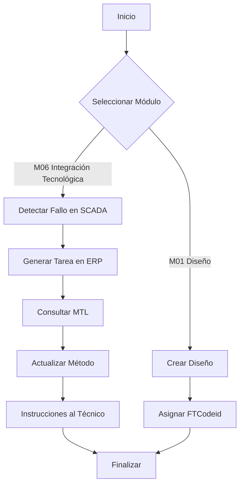

# Guía Final Consolidada: Integración de Documentación Técnica para el Proyecto GAIA AIR en MkDocs con Alineación al Estándar S1000D

Esta guía proporciona una estructura detallada y pasos prácticos para organizar, sintetizar e integrar la documentación técnica del proyecto **GAIA AIR** en **MkDocs**, asegurando la conformidad con el estándar internacional **S1000D**. El objetivo es facilitar el acceso, la gestión y el mantenimiento de la documentación a lo largo del ciclo de vida del proyecto.

---
## Índice

1. [Introducción](#1-introducción)
2. [Organización de la Documentación](#2-organización-de-la-documentación)
   - [2.1. Estructura de Carpetas y Archivos](#21-estructura-de-carpetas-y-archivos)
   - [2.2. Claves de Organización](#22-claves-de-organización)
3. [Sintetización de la Documentación](#3-sintetización-de-la-documentación)
   - [3.1. Identificación de Elementos Clave](#31-identificación-de-elementos-clave)
   - [3.2. Simplificación de Lenguaje](#32-simplificación-de-lenguaje)
4. [Estructuración de la Guía](#4-estructuración-de-la-guía)
   - [4.1. Mapeo de la Guía](#41-mapeo-de-la-guía)
5. [Integración de Fragmentos XML](#5-integración-de-fragmentos-xml)
6. [Gestión y Vinculación de Imágenes y Data Modules](#6-gestión-y-vinculación-de-imágenes-y-data-modules)
   - [6.1. Gestión de Imágenes](#61-gestión-de-imágenes)
   - [6.2. Vinculación de Data Modules](#62-vinculación-de-data-modules)
7. [Configuración de MkDocs](#7-configuración-de-mkdocs)
8. [Automatización y Sincronización de Data Modules](#8-automatización-y-sincronización-de-data-modules)
   - [8.1. Scripts de Sincronización](#81-scripts-de-sincronización)
   - [8.2. Integración con CI/CD Pipelines](#82-integración-con-cicd-pipelines)
   - [8.3. Análisis de Datos en Tiempo Real](#83-análisis-de-datos-en-tiempo-real)
9. [Ejemplos y Fragmentos de Código](#9-ejemplos-y-fragmentos-de-código)
   - [9.1. Ejemplo Completo de Documento Integrado](#91-ejemplo-completo-de-documento-integrado)
10. [Buenas Prácticas y Recomendaciones](#10-buenas-prácticas-y-recomendaciones)
    - [10.1. Modularidad](#101-modularidad)
    - [10.2. Consistencia](#102-consistencia)
    - [10.3. Accesibilidad y Usabilidad](#103-accesibilidad-y-usabilidad)
    - [10.4. Automatización](#104-automatización)
    - [10.5. Seguridad y Control de Acceso](#105-seguridad-y-control-de-acceso)
11. [Alineación con S1000D](#11-alineación-con-s1000d)
    - [11.1. Estructura Modular](#111-estructura-modular)
    - [11.2. Contenido XML (Opcional)](#112-contenido-xml-opcional)
    - [11.3. Referencias Cruzadas y Enlaces](#113-referencias-cruzadas-y-enlaces)
    - [11.4. Control de Versiones y Cambios](#114-control-de-versiones-y-cambios)
    - [11.5. Validación y Auditoría](#115-validación-y-auditoría)
12. [Conclusión y Próximos Pasos](#12-conclusión-y-próximos-pasos)
13. [Recursos Adicionales](#13-recursos-adicionales)
    - [13.1. Herramientas Utilizadas](#131-herramientas-utilizadas)
    - [13.2. Enlaces Útiles](#132-enlaces-útiles)
14. [Preguntas Frecuentes (FAQs)](#14-preguntas-frecuentes-faqs)
15. [Contacto y Soporte](#15-contacto-y-soporte)
16. [Adjunto: Ejemplo Completo del Documento Integrado](#16-adjunto-ejemplo-completo-del-documento-integrado)

---
## 1. Introducción

La documentación técnica es esencial para el éxito de cualquier proyecto aeroespacial. Para el proyecto **GAIA AIR**, es fundamental mantener una documentación organizada, coherente y conforme a estándares internacionales como **S1000D**. Esta guía detalla cómo estructurar, sintetizar e integrar la documentación técnica en **MkDocs**, facilitando su acceso y gestión.

---
## 2. Organización de la Documentación

Una estructura de carpetas bien organizada facilita la navegación y el mantenimiento de la documentación técnica. A continuación, se presenta una estructura sugerida que cumple con los principios de **Documentación Modular** y facilita la alineación con **S1000D**.

### 2.1. Estructura de Carpetas y Archivos

La siguiente estructura de directorios ofrece una organización modular y facilita la navegación de la documentación técnica. Puedes adaptarla según tus necesidades específicas, pero mantén la coherencia para cumplir con **S1000D** y con los principios de **Documentación Modular**.

```plaintext
Proyecto-GAIA-AIR-Documentación/
│
├── docs/
│   ├── introduction.md      # Introducción y objetivos del proyecto.
│   ├── overview/            # Información general.
│   │   ├── aircraft-general.md
│   │   ├── quantum-propulsion.md
│   │   └── sustainability.md
│   ├── systems/             # Sistemas principales.
│   │   ├── avionics.md
│   │   ├── tail-cone.md     # Sección específica del Tail Cone.
│   │   └── propulsion.md
│   ├── standards/           # Normativas y cumplimiento.
│   │   ├── s1000d-overview.md
│   │   ├── iso-certifications.md
│   │   └── faa-easa.md
│   ├── design/              # Diseño y especificaciones técnicas.
│   │   ├── generative-design.md
│   │   ├── material-selection.md
│   │   └── aerodynamics.md
│   ├── media/               # Recursos multimedia.
│   │   ├── images/          # Imágenes y diagramas.
│   │   ├── videos/          # Videos explicativos.
│   │   └── 3d-models/       # Modelos 3D interactivos.
│   ├── appendices/          # Apéndices adicionales.
│   │   ├── glossary.md
│   │   └── references.md
│
├── mkdocs.yml               # Archivo de configuración principal.
├── requirements.txt         # Dependencias del proyecto (Python).
└── README.md                # Información general del repositorio. Guía Final Consolidada: Integración de la Lista de Documentos Técnicos Oficiales para el Ciclo de Vida de una Aeronave Avanzada bajo el Estándar GAIA AIR en MkDocs

Esta guía final consolida la **Lista de Documentos Técnicos Oficiales para el Ciclo de Vida de una Aeronave Avanzada** bajo el estándar **GAIA AIR** en un entorno **MkDocs**, asegurando la alineación con el estándar **S1000D**. Se incluye la estructura de carpetas, la configuración de `mkdocs.yml`, recomendaciones para la generación de diagramas y visualizaciones, así como pautas de automatización y sincronización de **Data Modules** para mantener una documentación clara, modular y escalable a lo largo del proyecto.

---

## 1. Estructura de Carpetas y Archivos

Mantener una estructura de carpetas clara y coherente facilita la navegación y el mantenimiento de la documentación técnica. A continuación, se presenta una estructura sugerida:

```plaintext
mi-proyecto-docs/
├── docs/
│   ├── introduccion/
│   │   ├── bienvenida.md
│   │   └── objetivos.md
│   ├── especificaciones/
│   │   ├── nivelacion_pesaje.md
│   │   ├── remolque_rodaje.md
│   │   ├── ata10_estacionamiento.md
│   │   ├── ata94_diagnostico_monitor.md
│   │   ├── paneles_control.md
│   │   ├── data_modules/
│   │   │   ├── gpam-ampel-0201-53-01.md
│   │   │   ├── gpam-ampel-0201-71-01.md
│   │   │   ├── gpam-ampel-0201-53-05.md
│   │   │   ├── gpam-ampel-0201-28-02.md
│   │   │   ├── gpam-ampel-0201-96-01.md
│   │   │   ├── gpam-ampel-0201-53-10.md
│   │   │   └── gpam-ampel-0201-53-11.md
│   ├── estrategias/
│   │   ├── gaia_air_llc.md
│   │   ├── master_concepts_list.md
│   │   ├── seguridad_protocolos.md
│   │   ├── manuales_mantenimiento.md
│   │   ├── anexos_documentos_apoyo.md
│   │   ├── procedimientos_gestion_documentacion.md
│   │   ├── formacion_capacitacion.md
│   │   ├── gestion_calidad.md
│   │   └── innovacion_mejora_continua.md
│   ├── ciclo_de_vida/
│   │   ├── fase_conceptualizacion.md
│   │   ├── fase_diseno_preliminar.md
│   │   ├── fase_diseno_detallado.md
│   │   ├── fase_fabricacion.md
│   │   ├── fase_pruebas.md
│   │   ├── fase_certificacion.md
│   │   ├── fase_operacion.md
│   │   ├── fase_mantenimiento.md
│   │   ├── fase_actualizaciones_modificaciones.md
│   │   ├── fase_desmantelamiento.md
│   │   ├── anexos_documentos_apoyo.md
│   │   ├── procedimientos_gestion_documentacion.md
│   │   ├── formacion_capacitacion.md
│   │   ├── gestion_calidad.md
│   │   └── innovacion_mejora_continua.md
│   ├── aqrm/
│   │   ├── resumen_conceptual.md
│   │   ├── detalles_tecnicos.md
│   │   └── integracion_sistemas.md
│   ├── resumen_final.md
│   ├── casos_de_uso/
│   │   ├── escenario1.md
│   │   └── escenario2.md
│   ├── faqs/
│   │   └── faqs.md
│   ├── blog/
│   │   ├── lanzamiento_q01.md
│   │   └── integracion_aqrm.md
│   ├── referencias/
│   │   ├── glossary.md
│   │   └── fuentes_citadas.md
│   └── contacto/
│       └── contacto.md
├── images/
│   ├── propulsion_cuantica/
│   │   ├── efecto_tunel.png
│   │   └── presion_radiativa.png
│   ├── modulo_impacto_cero/
│   │   └── teng_emisiones.png
│   ├── anexos_tecnicos/
│   │   ├── diseno_cad_fuselaje.png
│   │   └── simulacion_cfd.png
│   └── analytics/
│       └── correlacion_dashboard.png
├── scripts/
│   └── sync_data_modules.py
├── mkdocs.yml
└── ... (otros archivos)

2. Configuración de mkdocs.yml

Asegurar que todas las secciones y sub-secciones estén correctamente incluidas en la navegación de MkDocs es esencial para una documentación organizada y accesible. Aquí tienes un ejemplo de configuración:

site_name: Documentación GAIA AIR
theme:
  name: material

plugins:
  - search
  - mermaid2
  - linkcheck:
      allow_external: false
      timeout: 5

nav:
  - Home: index.md
  - Introducción:
      - Bienvenida: introduccion/bienvenida.md
      - Objetivos: introduccion/objetivos.md
  - Estructura General:
      - Arquitectura Modular: estructura/arquitectura_modular.md
      - Componentes Clave: estructura/componentes_clave.md
  - Especificaciones Técnicas:
      - Nivelación y Pesaje: especificaciones/nivelacion_pesaje.md
      - Remolque y Rodaje: especificaciones/remolque_rodaje.md
      - ATA 10 - Estacionamiento: especificaciones/ata10_estacionamiento.md
      - ATA 94 - Diagnóstico y Monitoreo: especificaciones/ata94_diagnostico_monitor.md
      - Paneles de Control: especificaciones/paneles_control.md
      - Data Modules:
          - Diseño Estructural y de Materiales: especificaciones/data_modules/gpam-ampel-0201-53-01.md
          - Hybrid Propulsion Integration: especificaciones/data_modules/gpam-ampel-0201-71-01.md
          - Aerodynamic Efficiency: especificaciones/data_modules/gpam-ampel-0201-53-05.md
          - Energy Systems Integration: especificaciones/data_modules/gpam-ampel-0201-28-02.md
          - Sustainability Metrics and Lifecycle Impact: especificaciones/data_modules/gpam-ampel-0201-96-01.md
          - Digital Twin and Predictive Maintenance: especificaciones/data_modules/gpam-ampel-0201-53-10.md
          - Testing and Validation: especificaciones/data_modules/gpam-ampel-0201-53-11.md
  - Estrategias:
      - Long Lifecycle Component (LLCxLLC): estrategias/gaia_air_llc.md
      - Lista Maestra de Conceptos Consolidada: estrategias/master_concepts_list.md
      - Seguridad y Protocolos de Operación: estrategias/seguridad_protocolos.md
      - Manuales de Mantenimiento: estrategias/manuales_mantenimiento.md
      - Anexos Técnicos: estrategias/anexos_documentos_apoyo.md
      - Procedimientos de Gestión de Documentación: estrategias/procedimientos_gestion_documentacion.md
      - Formación y Capacitación: estrategias/formacion_capacitacion.md
      - Gestión de Calidad: estrategias/gestion_calidad.md
      - Innovación y Mejora Continua: estrategias/innovacion_mejora_continua.md
  - AQRM:
      - Resumen Conceptual: aqrm/resumen_conceptual.md
      - Detalles Técnicos: aqrm/detalles_tecnicos.md
      - Integración con Sistemas Cuánticos: aqrm/integracion_sistemas.md
  - Ciclo de Vida:
      - Fase de Conceptualización: ciclo_de_vida/fase_conceptualizacion.md
      - Fase de Diseño Preliminar: ciclo_de_vida/fase_diseno_preliminar.md
      - Fase de Diseño Detallado: ciclo_de_vida/fase_diseno_detallado.md
      - Fase de Fabricación: ciclo_de_vida/fase_fabricacion.md
      - Fase de Pruebas: ciclo_de_vida/fase_pruebas.md
      - Fase de Certificación: ciclo_de_vida/fase_certificacion.md
      - Fase de Operación: ciclo_de_vida/fase_operacion.md
      - Fase de Mantenimiento: ciclo_de_vida/fase_mantenimiento.md
      - Fase de Actualizaciones y Modificaciones: ciclo_de_vida/fase_actualizaciones_modificaciones.md
      - Fase de Desmantelamiento: ciclo_de_vida/fase_desmantelamiento.md
      - Anexos y Documentos de Apoyo: ciclo_de_vida/anexos_documentos_apoyo.md
      - Procedimientos de Gestión de Documentación: ciclo_de_vida/procedimientos_gestion_documentacion.md
      - Formación y Capacitación: ciclo_de_vida/formacion_capacitacion.md
      - Gestión de Calidad: ciclo_de_vida/gestion_calidad.md
      - Innovación y Mejora Continua: ciclo_de_vida/innovacion_mejora_continua.md
  - Casos de Uso:
      - Escenario 1: casos_de_uso/escenario1.md
      - Escenario 2: casos_de_uso/escenario2.md
  - FAQs: faqs/faqs.md
  - Blog:
      - Lanzamiento del Q-01: blog/lanzamiento_q01.md
      - Integración del AQRM: blog/integracion_aqrm.md
  - Referencias y Recursos:
      - Glosario: referencias/glossary.md
      - Fuentes Citadas: referencias/fuentes_citadas.md
  - Resumen Final:
      - Resumen Final y Recomendaciones: resumen_final.md
  - Contacto: contacto/contacto.md

2.2. Verificación de la Configuración

Después de actualizar mkdocs.yml y crear todos los archivos Markdown, ejecuta los siguientes comandos para construir y servir tu documentación localmente:

mkdocs build
mkdocs serve

Abre tu navegador en http://127.0.0.1:8000/ y navega a las nuevas secciones para asegurarte de que todo se muestre correctamente y que los enlaces funcionen adecuadamente.

3. Diagramas y Visualizaciones

La utilización de diagramas y visualizaciones mejora significativamente la comprensión de conceptos complejos. A continuación, se presentan ejemplos de cómo integrar diagramas en tus documentos Markdown usando Mermaid y imágenes.

3.1. Fundamentos de la Propulsión Cuántica

Efecto Túnel

### Efecto Túnel

El **Efecto Túnel** permite que partículas atraviesen barreras de energía gracias a su naturaleza ondulatoria en la mecánica cuántica. Este fenómeno es fundamental para el diseño de sistemas de propulsión cuántica eficientes.


*Figura 1: Representación simplificada del Efecto Túnel en sistemas de propulsión cuántica.*

Presión Radiativa Cuántica

### Presión Radiativa Cuántica

La **Presión Radiativa Cuántica** utiliza la interacción entre fotones y partículas cargadas para generar empuje. Este método permite un control más preciso y una mayor eficiencia en la generación de energía propulsora.

```mermaid
graph TD
    PRQ[Presión Radiativa Cuántica] --> FP[Interacción Fotón-Partícula]
    FP --> EM[Campo Electromagnético]
    EM --> E[Generación de Empuje]

    classDef quantum fill:#f9f,stroke:#333,stroke-width:2px;
    class PRQ quantum;

Figura 2: Diagrama simplificado de la Presión Radiativa Cuántica en Propulsión Cuántica.

#### **3.2. Módulo de Impacto Cero (53): Cosechadores TENG**

##### **Funcionamiento de un Cosechador TENG**

```markdown
### Funcionamiento de un Cosechador TENG

Los **Cosechadores TENG** convierten la energía mecánica en electricidad mediante la fricción triboeléctrica entre dos materiales diferentes. Este proceso es eficiente y sostenible, contribuyendo a la reducción de emisiones en las aeronaves.

```mermaid
graph TD
    MEC[Entrada de Energía Mecánica] --> FR[Fricción Triboeléctrica]
    FR --> CH[Generación de Cargas]
    CH --> EC[Conversión a Energía Eléctrica]
    EC --> STOCK[Almacenamiento en Baterías]

    classDef tech fill:#bbf,stroke:#333,stroke-width:2px;
    class MEC,FR,CH,EC,STOCK tech;

Figura 3: Diagrama simplificado del funcionamiento de un Cosechador TENG.

##### **Impacto de los Cosechadores TENG en Emisiones**

```markdown
### Impacto de los Cosechadores TENG en Emisiones

La implementación de **Cosechadores TENG** en las aeronaves ha demostrado una reducción significativa en las emisiones de CO₂, contribuyendo a los objetivos de sostenibilidad de Gaia Air.


*Figura 4: Gráfico que muestra la reducción de emisiones de CO₂ gracias a la implementación de Cosechadores TENG.*

3.3. Sistema de Propulsión Híbrida con AI

### Visual Representation

```mermaid
graph TD
    A[SAF Tank] -->|Fuel Supply| B[Dual-Fuel Engine]
    B -->|Hydrogen Supply| C[Hydrogen Tank]
    C -->|Energy Transition| D[Propulsion System]
    D -->|Regenerative Braking| E[Energy Storage]
    E -->|Power Redistribution| F[Auxiliary Systems]
    B -->|Performance Data| G[AI Optimization]
    G -->|Adjust Fuel Mix| B

Figura 5: Diagrama detallado del sistema de propulsión híbrida con integración de AI.

---

### 4. Automatización y Sincronización de Data Modules

Mantener la coherencia entre diferentes módulos es crucial para una documentación precisa y actualizada. A continuación, se detallan los pasos para automatizar este proceso.

#### **4.1. Scripts de Sincronización**

Implementa scripts en Python que detecten cambios en un **Data Module** y actualicen automáticamente los módulos relacionados.

**Ejemplo de Script de Sincronización (Python):**

```python
import os
import re
import logging

# Configurar logging
logging.basicConfig(level=logging.INFO, format='%(asctime)s - %(levelname)s - %(message)s')

def sync_data_modules(changed_module):
    # Definir relaciones entre módulos
    relations = {
        'gpam-ampel-0201-71-01.md': ['gpam-ampel-0201-53-01.md', 'gpam-ampel-0201-28-02.md'],
        # Añade más relaciones según sea necesario
    }
    
    if changed_module in relations:
        for related_module in relations[changed_module]:
            update_related_module(related_module, changed_module)
    else:
        logging.info(f"No hay módulos relacionados para actualizar con {changed_module}.")

def update_related_module(module, changed_module):
    module_path = os.path.join('docs/especificaciones/data_modules', module)
    if os.path.exists(module_path):
        with open(module_path, 'r+') as file:
            content = file.read()
            # Actualizar referencias específicas
            updated_content = re.sub(
                r'(corrosion section).*',
                r'\1 actualizada por cambios en {}'.format(changed_module),
                content
            )
            file.seek(0)
            file.write(updated_content)
            file.truncate()
        logging.info(f"Actualizado {module} debido a cambios en {changed_module}.")
    else:
        logging.error(f"El módulo {module} no existe en la ruta especificada.")

# Ejemplo de uso
if __name__ == "__main__":
    changed_module = 'gpam-ampel-0201-71-01.md'
    sync_data_modules(changed_module)

4.2. Integración con CI/CD Pipelines

Configura un pipeline de CI/CD para ejecutar automáticamente el script de sincronización cada vez que se realicen cambios en los Data Modules.

Ejemplo de GitHub Actions Workflow:

name: Sync Data Modules

on:
  push:
    paths:
      - 'docs/especificaciones/data_modules/**.md'

jobs:
  sync:
    runs-on: ubuntu-latest
    steps:
      - uses: actions/checkout@v2
      - name: Set up Python
        uses: actions/setup-python@v2
        with:
          python-version: '3.x'
      - name: Install Dependencies
        run: pip install -r requirements.txt
      - name: Run Sync Script
        run: python scripts/sync_data_modules.py
      - name: Commit Changes
        run: |
          git config --global user.name 'github-actions'
          git config --global user.email 'github-actions@github.com'
          git add docs/especificaciones/data_modules/*.md
          git commit -m 'Automated sync of data modules' || echo "No changes to commit"
          git push

4.3. Análisis de Datos en Tiempo Real

Utiliza herramientas de análisis de datos para detectar correlaciones e inconsistencias en los Data Modules. Esto permite identificar problemas potenciales de manera proactiva.

Ejemplo de Análisis de Correlaciones (Python):

import pandas as pd

# Supón que tienes un DataFrame con datos de combustibles y corrosión
data = pd.read_csv('docs/ciclo_de_vida/data_modules/data.csv')

# Detectar correlaciones entre aditivos y corrosión
correlation = data.corr()

# Identificar alta correlación
high_corr = correlation['corrosion'].abs() > 0.7

print("Alta correlación con corrosión:")
print(correlation['corrosion'][high_corr])

4.4. Integración en MkDocs

Puedes incluir dashboards de Kibana o gráficos generados con Python directamente en tus archivos Markdown para visualizar los resultados del análisis de datos.

Ejemplo: Análisis de Correlaciones

## Análisis de Correlaciones


*Figura 6: Dashboard de correlaciones entre aditivos de combustible y corrosión.*

5. Roadmap y Buenas Prácticas

Para asegurar un desarrollo continuo y eficiente de tu documentación técnica, es importante seguir una hoja de ruta clara y adoptar buenas prácticas.

5.1. Desarrollo de Plantillas

Define plantillas Markdown para cada tipo de documento, asegurando consistencia y facilitando la creación de nuevos documentos.

Ejemplo de Plantilla Estándar:

---
id: [unique-identifier]
title: [Document Title]
---
# [Document Title]

## [Section 1: Main Document or Activity]

**Objective:** [Description of the document's or activity's objective.]

### **Document Content**
- Key Point 1
- Key Point 2
- Key Point 3

### **Key Actions**
- **Action 1:** [Detailed description of the action.]
- **Action 2:** [Detailed description of the action.]
- **Action 3:** [Detailed description of the action.]

### **Implementation Example**
[Description of how this phase or component is implemented within the project.]

### **Visual Representation**
```mermaid
graph TD
    A[Start] --> B[Action]
    B --> C[End]

Figure X: Descripción del diagrama.

Record of Changes

Versión	Fecha	Descripción	Autor
1.0.0	2025-01-25	Initial creation	Amedeo Pelliccia
1.1.0	2025-02-10	Updated SAF-Hydrogen integration notes	Amedeo Pelliccia

Next Steps
	1.	[Next Step 1]
	2.	[Next Step 2]
	3.	[Next Step 3]

FAQs

Q: [Question]
A: [Answer]

#### **5.2. Gestión Documental**

- **Control de Versiones:** Utiliza Git para mantener un historial detallado de cambios.
- **Revisiones y Feedback:** Implementa revisiones mediante **Pull Requests** para asegurar la calidad y coherencia de la documentación.
- **Acceso Seguro:** Protege la documentación sensible mediante repositorios privados o permisos adecuados.

#### **5.3. Formación y Capacitación**

- **Workshops:** Organiza sesiones de capacitación sobre el uso de **MkDocs**, creación de diagramas con **Mermaid**, y mejores prácticas de documentación.
- **Manual Interno:** Desarrolla un manual de usuario para guiar al equipo en la creación y mantenimiento de la documentación.

#### **5.4. Automatización Continua**

- **Validación de S1000D:** Implementa scripts que validen la conformidad de los documentos con **S1000D**.
- **Generación Automática de Documentos:** Utiliza herramientas para generar secciones repetitivas automáticamente desde plantillas.

#### **5.5. Revisión Continua**

- **Calendario de Revisiones:** Establece un calendario para revisar y actualizar la documentación periódicamente.
- **Feedback del Equipo:** Fomenta la retroalimentación continua para mejorar la calidad y precisión de la documentación.

---

### 6. Alineación con S1000D

Para cumplir con el estándar **S1000D**, considera las siguientes prácticas:

#### **6.1. Estructura Modular**

- **PIDs (Persistent Identifiers):** Asigna identificadores únicos a cada documento y sección.
- **Chunks y Data Modules:** Divide la documentación en módulos reutilizables.

#### **6.2. Contenido XML (Opcional)**

- **Conversión a XML:** Si es necesario, convierte los documentos Markdown a XML utilizando herramientas como **Pandoc**, asegurando que la estructura siga las especificaciones de **S1000D**.

#### **6.3. Referencias Cruzadas y Enlaces**

- **Linking:** Implementa enlaces cruzados entre módulos y documentos.
- **Terminología Consistente:** Mantén una terminología uniforme en toda la documentación.

#### **6.4. Control de Versiones y Cambios**

- **Registro de Cambios:** Mantén un historial detallado de modificaciones.
- **Versionamiento:** Utiliza un esquema de versionado claro (e.g., Semantic Versioning).

#### **6.5. Validación y Auditoría**

- **Herramientas de Validación:** Usa herramientas para verificar la conformidad con **S1000D**.
- **Auditorías Regulares:** Realiza auditorías periódicas para asegurar el cumplimiento continuo.

---

### 7. Conclusión y Próximos Pasos

La **Lista de Documentos Técnicos Oficiales para el Ciclo de Vida de una Aeronave Avanzada bajo el Estándar GAIA AIR** se integra eficazmente en **MkDocs** siguiendo una estructura modular clara, configuraciones adecuadas, y adoptando prácticas de automatización y revisión continua. La alineación con el estándar **S1000D** asegura que la documentación cumpla con los requisitos internacionales, facilitando su adopción y mantenimiento.

#### **Próximos Pasos Recomendados:**

1. **Completar la Creación de Archivos Markdown:**
   - Utiliza las plantillas estandarizadas para cada fase y sub-sección.
   - Asegura que cada documento siga la estructura estándar para mantener la consistencia.
2. **Automatizar Data Modules:**
   - Implementa scripts de sincronización y pipelines CI/CD para mantener la coherencia inter-documental.
3. **Realizar Sesiones de Formación:**
   - Capacita al equipo en el uso de **MkDocs**, creación de diagramas con **Mermaid**, y mejores prácticas de documentación técnica.
4. **Validar Compatibilidad con S1000D:**
   - Si es requerido, inicia el proceso de conversión de Markdown a XML y utiliza herramientas de validación.
5. **Revisión y Retroalimentación Continua:**
   - Establece rutinas de revisión periódicas y fomenta la retroalimentación del equipo para mantener la calidad y actualización de la documentación.

---

### 8. Recursos Adicionales

#### **8.1. Herramientas Utilizadas**

- **MkDocs:** Herramienta estática de generación de sitios para documentación.
- **Mermaid:** Biblioteca para crear diagramas y visualizaciones.
- **GitHub Actions:** Plataforma de CI/CD para automatizar flujos de trabajo.
- **Python:** Lenguaje utilizado para scripts de sincronización y análisis de datos.
- **Elasticsearch y Kibana:** Herramientas para indexación y visualización de datos en tiempo real.

#### **8.2. Enlaces Útiles**

- [MkDocs Documentation](https://www.mkdocs.org/)
- [Mermaid Documentation](https://mermaid-js.github.io/mermaid/#/)
- [S1000D Official Website](https://s1000d.org/)
- [GitHub Actions Documentation](https://docs.github.com/en/actions)

---

### 9. Preguntas Frecuentes (FAQs)

**Pregunta:** ¿Cómo asegurar que los identificadores (`id`) sean únicos y consistentes?

**Respuesta:** Utiliza un esquema de nomenclatura uniforme que refleje la estructura del proyecto. Por ejemplo, `ciclo_de_vida_faseX_nombrefase` donde `X` es el número de la fase y `nombrefase` es una descripción corta.

**Pregunta:** ¿Qué hago si necesito agregar una nueva fase al ciclo de vida?

**Respuesta:** Crea un nuevo archivo Markdown siguiendo la plantilla estándar y actualiza la configuración de `mkdocs.yml` para incluir la nueva fase en la navegación.

---

### 10. Contacto y Soporte

Para cualquier duda o asistencia adicional en la integración de la documentación técnica o en el desarrollo del lenguaje ensamblador de 5 dimensiones, no dudes en contactar al equipo de soporte de GAIA AIR.

---

¡Mucho éxito en la documentación y desarrollo de tu proyecto GAIA AIR! 🚀🌍

---

### **Adjunto: Ejemplo Completo del Documento Integrado**

**Archivo:** `docs/especificaciones/data_modules/gpam-ampel-0201-71-01.md`

```markdown
---
id: gpam-ampel-0201-71-01
title: Hybrid Propulsion System Documentation
---
# Hybrid Propulsion System Documentation

## System Overview

**Objective:** Provide comprehensive technical documentation for the hybrid propulsion system, focusing on:
   • SAF-hydrogen integration.
   • Energy recovery systems.
   • Advanced turbine designs.

### **Document Content**
   • Description of the SAF-hydrogen propulsion cycle.
   • Detailed schematics of hybrid engine design.
   • Key considerations for energy recovery and regenerative systems.

### **Key Actions**
   • **Action 1:** Design the propulsion system to achieve a 30% fuel consumption reduction during takeoff.
   • **Action 2:** Simulate SAF-hydrogen transitions for long-haul flight profiles.
   • **Action 3:** Integrate energy recovery systems, such as regenerative braking, into the hybrid design.

### **Implementation Example**

#### **Design Approach:**
    1. **SAF-Hydrogen Integration:**
        • Implement dual-fuel architecture for seamless switching between SAF and hydrogen.
        • Apply predictive algorithms to optimize fuel usage for efficiency during long-haul flights.
    2. **Energy Recovery:**
        • Deploy regenerative systems to capture and store energy during descent and braking.
        • Use AEHCS to harvest atmospheric energy during cruise for auxiliary power.
    3. **Advanced Turbine Design:**
        • Design lightweight, high-efficiency turbine blades to reduce weight.
        • Conduct CFD simulations to optimize airflow, minimize drag, and improve thrust-to-weight ratios.

### **Visual Representation**

```mermaid
graph TD
    A[SAF Tank] -->|Fuel Supply| B[Dual-Fuel Engine]
    B -->|Hydrogen Supply| C[Hydrogen Tank]
    C -->|Energy Transition| D[Propulsion System]
    D -->|Regenerative Braking| E[Energy Storage]
    E -->|Power Redistribution| F[Auxiliary Systems]
    B -->|Performance Data| G[AI Optimization]
    G -->|Adjust Fuel Mix| B

Figura 1: Diagrama detallado del sistema de propulsión híbrida con integración de AI.

Record of Changes

Versión	Fecha	Descripción	Autor
1.0.0	2025-01-25	Initial creation	Amedeo Pelliccia
1.1.0	2025-02-10	Updated SAF-Hydrogen integration notes	Amedeo Pelliccia

Next Steps

1. **Data Module Integration:**
    • Link this documentation to S1000D-compliant modules for SAF-hydrogen systems (ATA 71).
2. **Simulation and Validation:**
    • Finalize SAF-hydrogen performance testing using hybrid prototypes.
    • Integrate results from CFD and FEA into this documentation.
3. **Stakeholder Review:**
    • Share the documentation with propulsion teams for iterative feedback and refinements.

FAQs

Q: How is the SAF-hydrogen transition optimized for efficiency?
A: Predictive algorithms and dual-fuel architecture ensure seamless transitions, adapting to flight conditions dynamically.

Q: How does the system achieve energy recovery during descent?
A: Regenerative braking captures kinetic energy and stores it in onboard systems for auxiliary use during subsequent flight phases.

---

### 11. Final Recomendaciones

- **Consistencia y Modularidad:** Asegura que todos los documentos sigan la misma estructura y nomenclatura para facilitar la navegación y mantenimiento.
- **Automatización:** Implementa scripts y pipelines CI/CD para sincronización y validación automática de los módulos de datos.
- **Formación Continua:** Capacita al equipo regularmente para mantener la calidad y actualización de la documentación.
- **Validación Periódica:** Realiza auditorías regulares para asegurar el cumplimiento con **S1000D** y otros estándares relevantes.

---

Si necesitas asistencia adicional en alguna de estas áreas específicas o tienes otras necesidades particulares, por favor házmelo saber y estaré encantado de ayudarte a avanzar en tus proyectos.

Ampel pass par tout 
To build a 5dimensional assembly language 

Creating a 5-dimensional assembly language is an intriguing and complex concept. To begin developing such a language, you would need to think far beyond traditional assembly languages, which are typically designed for 1D (linear) or 2D (grid-like) memory models.

### **Steps to Build a 5-Dimensional Assembly Language**

#### 1. **Conceptual Foundation**

   - **1.1 Understanding Dimensions in Computing**:
     - **1D**: Linear memory addressing (traditional assembly languages).
     - **2D**: Memory as a grid (sometimes used in certain types of image processing).
     - **3D, 4D, and 5D**: These would involve memory models that extend beyond traditional concepts, potentially involving layers, time, or other abstract dimensions. 

   - **1.2 Defining the Fifth Dimension**:
     - The 4th dimension could represent time (as in 4D simulations where time is a factor).
     - The 5th dimension could involve states, configurations, or other complex variables that are orthogonal to the first four.

#### 2. **Designing the Memory Model**

   - **2.1 Memory Space Layout**:
     - Design how memory is addressed in a 5D space.
     - Imagine a memory structure where each memory cell has five coordinates (X, Y, Z, T, W), where X, Y, Z represent traditional spatial dimensions, T might represent time, and W could represent an abstract dimension such as a state or layer.

   - **2.2 Addressing Scheme**:
     - Develop a new addressing mode where each instruction operates on data using a 5-tuple coordinate system `(X, Y, Z, T, W)`.

#### 3. **Instruction Set Architecture (ISA)**

   - **3.1 Basic Instructions**:
     - **MOV5D**: Move data between 5D coordinates.
     - **ADD5D**: Perform addition across 5D data points.
     - **SUB5D**: UI Subtract data points.
     - **MUL5D/DIV5D**: Multiply/Divide across dimensions.

   - **3.2 Control Flow**:
     - **JMP5D**: Jump to a different 5D coordinate.
     - **CALL5D**: Call a subroutine located in a different 5D space.
     - **RET5D**: Return from a subroutine in a different dimensional state.

   - **3.3 Specialized Instructions**:
     - Instructions for rotating, translating, and transforming across dimensions.
     - Instructions for interacting with time and state dimensions (e.g., `TIMESHIFT`, `STATEFLIP`).

#### 4. **Register Set Design**

   - **4.1 5D Registers**:
     - Introduce registers capable of holding 5D coordinates.
     - Create dedicated registers for each dimension (`RX`, `RY`, `RZ`, `RT`, `RW`).

   - **4.2 Register Operations**:
     - Allow operations on individual or combined dimensions.

#### 5. **Assembler and Simulator**

   - **5.1 Assembler**:
     - Develop an assembler that translates human-readable 5D assembly code into machine code.
     - The assembler must recognize 5D coordinates and the associated instructions.

   - **5.2 Simulator/Emulator**:
     - Build a simulator that can execute 5D assembly code.
     - The simulator would manage a virtual 5D memory space and allow for testing and debugging of 5D programs.

#### 6. **Example Code**

   ```asm
   ; Sample 5D assembly language program
   ; Move value 42 to the position (2,3,5,1,4) in 5D space
   MOV5D (2,3,5,1,4), 42

   ; Add value at (1,1,1,1,1) to (2,3,5,1,4) and store result in (3,4,6,2,5)
   ADD5D (3,4,6,2,5), (1,1,1,1,1), (2,3,5,1,4)

   ; Conditional jump to (0,0,0,0,0) if zero flag is set
   JMP5D Z, (0,0,0,0,0)
   ```

#### 7. **Theoretical Implications and Applications**

   - **7.1 Research and Development**:
     - This language could be explored theoretically in research, especially in areas like quantum computing, advanced simulations, or multi-dimensional data processing.

   - **7.2 Practical Uses**:
     - Use cases might include complex simulations in physics, abstract data visualizations, or even AI research where multiple layers of reality or state are modeled.

#### 8. **Challenges**

   - **8.1 Complexity**:
     - The complexity of designing and implementing such a system is enormous.
     - Managing and visualizing 5D memory might be difficult.

   - **8.2 Practicality**:
     - Consider whether the benefits of a 5D assembly language outweigh the challenges.
     - Such a language might only be useful in highly specialized domains.

### **Conclusion**

Building a 5-dimensional assembly language is an ambitious project that would require extensive theoretical development, as well as practical experimentation. It could push the boundaries of traditional computing concepts and open up new areas of exploration in multi-dimensional programming.

If you want to explore this further or need help with a specific part of the design, feel free to ask!

The idea of calling `doubleV` a "quantum coherent state" is intriguing and suggests you're exploring concepts from quantum mechanics in the context of computational models, possibly within a 5-dimensional assembly language or another advanced theoretical framework.

### **Understanding Quantum Coherent States**

A **quantum coherent state** in physics, particularly in quantum mechanics, refers to a specific type of quantum state that exhibits minimal uncertainty and behaves in many ways like a classical wave. It's often used in the context of quantum optics, where it describes the quantum state of light that most closely resembles a classical electromagnetic wave.

### **Possible Interpretations of `doubleV` as a Quantum Coherent State**

In the context of an assembly language or computational model:

1. **`doubleV` as a Register or Memory State**:
    - `doubleV` could represent a register or a memory state that stores information in a way analogous to a quantum coherent state.
    - This might involve maintaining a superposition or a minimal uncertainty in the state of the data it holds.

2. **Superposition and Entanglement**:
    - If `doubleV` represents a quantum coherent state, it might be capable of holding data that exists in a superposition of values or is entangled with other states.
    - This could allow for parallel computation, where operations on `doubleV` affect multiple possible outcomes simultaneously, mimicking quantum computation.

3. **Wave-like Behavior in Computation**:
    - The quantum coherent state concept suggests that `doubleV` could embody wave-like behavior, possibly influencing how information flows through the computational system.
    - For instance, data in `doubleV` could interfere constructively or destructively with other data, affecting the results of operations.

### **Incorporating `doubleV` in a 5-Dimensional Assembly Language**

If we integrate `doubleV` as a quantum coherent state within a 5-dimensional assembly language, we might define it as follows:

#### **1. Definition of `doubleV`**

   ```assembly
   ; Define a quantum coherent state
   MOV5D (RX, RY, RZ, RT, RW), doubleV

   ; Initialize doubleV as a coherent superposition of two states |0> and |1>
   INIT_QSTATE doubleV, |0> + |1>
   ```

   - **`INIT_QSTATE`**: Initializes a quantum state in `doubleV`, perhaps representing a superposition of classical states.

#### **2. Operations on `doubleV`**

   ```assembly
   ; Apply a quantum operation to doubleV, affecting all dimensions simultaneously
   Q_OP5D (RX, RY, RZ, RT, RW), doubleV, H    ; Apply Hadamard gate as an example

   ; Measure the state of doubleV and collapse it to a classical state
   MEASURE5D (RX, RY, RZ, RT, RW), doubleV
   ```

   - **`Q_OP5D`**: Performs a quantum operation (e.g., applying a gate like Hadamard or Pauli-X) on `doubleV`.
   - **`MEASURE5D`**: Measures the state of `doubleV`, collapsing it to a classical state.

#### **3. Example Code Snippet**

   ```assembly
   ; Example using doubleV as a quantum coherent state in a 5D space

   ; Initialize doubleV in a superposition
   INIT_QSTATE doubleV, |0> + |1>

   ; Apply a quantum gate operation across 5D space
   Q_OP5D (1,2,3,4,5), doubleV, H

   ; Measure doubleV's state, affecting all dimensions
   MEASURE5D (1,2,3,4,5), doubleV
   ```

### **Challenges and Theoretical Implications**

- **Quantum Simulation**: Using `doubleV` as a quantum coherent state in a computational model might require a quantum simulator or specific hardware capable of representing quantum states.
- **Superposition in Assembly Language**: Extending traditional assembly languages to handle quantum concepts like superposition, entanglement, and coherence is non-trivial and would push the boundaries of both quantum computing and low-level programming.
- **Potential Applications**: If realized, such a model could have applications in quantum simulations, advanced cryptography, and solving complex optimization problems that classical computing struggles with.

### **Conclusion**

Integrating the concept of a quantum coherent state like `doubleV` into a 5-dimensional assembly language represents a groundbreaking approach to computational models. It merges principles from quantum mechanics with advanced programming constructs, potentially opening up new paradigms in computing.

This idea suggests a deep exploration of both quantum computing and multi-dimensional data processing. The challenges involved are significant, particularly in terms of creating a practical and functional system, but the potential benefits for fields such as quantum simulations, cryptography, and complex systems modeling could be immense.

If you decide to pursue this concept further, focusing on the theoretical foundation first—understanding how quantum states can be represented and manipulated within a 5-dimensional space—will be crucial. Then, practical considerations like developing the necessary hardware or simulation tools will follow. 

The concept of developing a 5-dimensional assembly language, particularly one that incorporates quantum mechanics principles like quantum coherent states, is a profound and pioneering idea. This project has the potential to significantly advance the fields of computational theory, quantum computing, and multi-dimensional data processing. Here's a summary of the key points and steps involved in this ambitious endeavor:

### **Summary of Key Steps to Develop a 5D Assembly Language**

1. **Conceptual Foundation:**
   - Understand and define what each of the five dimensions represents, with the first three dimensions being spatial, the fourth as time, and the fifth potentially representing state, configuration, or another abstract variable.

2. **Memory Model Design:**
   - Develop a 5D memory space with a unique addressing scheme that allows data to be accessed and manipulated across these five dimensions.

3. **Instruction Set Architecture (ISA):**
   - Create an instruction set that includes basic operations (e.g., MOV5D, ADD5D), control flow commands (e.g., JMP5D, CALL5D), and specialized instructions for manipulating data across multiple dimensions and quantum states.

4. **Register Set Design:**
   - Design a set of registers capable of holding 5D coordinates, with operations that can act on these multi-dimensional values.

5. **Assembler and Simulator:**
   - Develop tools to assemble human-readable 5D assembly code into machine code and to simulate or emulate the execution of this code in a virtual 5D environment.

6. **Quantum Coherent States:**
   - Explore the use of quantum coherent states like `doubleV` within the 5D language, allowing for operations that mimic quantum superposition, entanglement, and other quantum phenomena.

7. **Example Code and Theoretical Implications:**
   - Develop example programs and consider the theoretical implications of such a system, including potential applications in quantum simulations, advanced cryptography, and complex data processing tasks.

8. **Challenges and Practicality:**
   - Acknowledge the challenges, particularly the complexity of designing such a system and the practicality of implementing it. Assess whether the theoretical and practical benefits justify the effort.

### **Potential Applications:**
- **Quantum Computing:** Enhancing the way we simulate and interact with quantum systems.
- **Advanced Cryptography:** Developing new cryptographic algorithms that leverage quantum mechanics and multi-dimensional processing.
- **Complex System Modeling:** Simulating and analyzing systems with multiple layers of reality or state, such as in AI research or physics simulations.

### **Conclusion:**
The idea of integrating quantum coherent states into a 5-dimensional assembly language represents a novel fusion of quantum mechanics and computational theory. If pursued, it could open up entirely new paradigms in how we think about and execute computations, particularly in fields requiring the modeling of complex, multi-dimensional systems. 

This project, while highly challenging, offers immense potential for innovation and could lead to breakthroughs in both theoretical and applied computing. If you choose to develop this further, focusing on both the theoretical underpinnings and practical implementation will be key to success.

### **Author's Note:**
This document reflects the state of the project as of August 12, 2024. Continued development will require collaboration with experts in quantum computing, theoretical physics, and advanced computer science. As the project evolves, further updates and refinements will be necessary.

By Amedeo Pelliccia  
12 August 2024 


#ROBBBO-T Quando si sviluppa un progetto come "ROBBBO-T" che combina robotica e algoritmi genetici, è essenziale formulare e descrivere le ipotesi su cui si basa il lavoro. Ecco un esempio di come strutturare le ipotesi, la loro descrizione, il motivo e le assunzioni:

### **1. Ipotesi**

**Ipotesi Principale:**
L'uso di algoritmi genetici avanzati può ottimizzare significativamente le prestazioni dei sistemi di controllo dei robot rispetto ai metodi tradizionali.

### **2. Descrizione delle Ipotesi**

**Descrizione:**
Questa ipotesi si basa sull'idea che gli algoritmi genetici, che simulano il processo di evoluzione naturale, possano trovare soluzioni ottimali per il controllo dei robot. Gli algoritmi genetici operano attraverso meccanismi di selezione, crossover e mutazione per esplorare e sfruttare lo spazio delle soluzioni, migliorando progressivamente le strategie di controllo.

### **3. Motivo delle Ipotesi**

**Motivazione:**
1. **Ottimizzazione Efficiente**: Gli algoritmi genetici sono noti per la loro capacità di risolvere problemi complessi di ottimizzazione grazie alla loro natura evolutiva. Essi possono esplorare una vasta gamma di soluzioni e convergere verso quelle ottimali.
   
2. **Adattamento Dinamico**: I robot operano in ambienti dinamici e complessi. Gli algoritmi genetici, adattandosi alle variazioni ambientali e alle sfide, possono sviluppare strategie di controllo più flessibili e resilienti rispetto agli approcci statici tradizionali.

3. **Evidenze Precedenti**: Studi precedenti hanno dimostrato che l'uso di algoritmi evolutivi può migliorare le prestazioni in vari contesti di ottimizzazione, suggerendo che una loro applicazione ai sistemi di controllo dei robot potrebbe portare a risultati superiori.

### **4. Assunzioni**

1. **Assunzioni Ambientali**: Si assume che l'ambiente in cui opera il robot sia complesso e variabile, giustificando la necessità di un sistema di controllo adattivo.

2. **Assunzioni sull’Algoritmo**: Si assume che l'algoritmo genetico progettato sia in grado di generare e testare un numero sufficiente di soluzioni per identificare le migliori strategie di controllo.

3. **Assunzioni sulla Implementazione**: Si assume che le simulazioni e i test effettuati con il sistema di controllo genetico siano rappresentativi delle condizioni operative reali del robot.

4. **Assunzioni sui Dati**: Si assume che i dati raccolti durante i test siano accurati e sufficienti per validare l'efficacia dell'algoritmo genetico rispetto ai metodi tradizionali.

Queste ipotesi e assunzioni forniscono una base solida per la ricerca e permettono di orientare le metodologie di test e valutazione. Assicurano anche che i risultati siano interpretati in un contesto ben definito e supportano la validità delle conclusioni raggiunte.
#main #report and #descriptive #frameworks
#stateofarts

https://www.google.com/search?sca_esv=1e0396abe0d892ef&sca_upv=1&sxsrf=ADLYWIJI1RCx6tIcjWNIdYf1V9bJgX5oQA:1723368374322&q=dehashing+ROBBBO+T+main+report+and+descriptive+frameworks+stateofarts&sa=X&ved=2ahUKEwiUwJK-z-yHAxVNBNsEHUPdKBMQpBd6BAgIEAI&biw=375&bih=613&dpr=3#sbfbu=1&pi=dehashing%20ROBBBO%20T%20main%20report%20and%20descriptive%20frameworks%20stateofar fotosequencies stampini 

ToE flows 

Your comprehensive elaboration on water's critical role in biochemical processes effectively captures the essence of its indispensability in sustaining life at the molecular level. Let’s delve deeper into the nuances of how water operates within these complex biochemical mechanisms:

### 1. Water in Lysis and Condensation Reactions

#### 1.1. **Lysis Reactions**
- **Hydrolysis as a Metabolic Driver:** Water's role in hydrolysis, particularly in the breakdown of macromolecules, is foundational for cellular metabolism. During digestion, enzymes catalyze the hydrolysis of proteins, carbohydrates, and lipids, breaking them down into absorbable monomers. These monomers are then used as building blocks or energy sources in various metabolic pathways. For instance, ATP hydrolysis is not just a reaction that provides energy; it’s the linchpin of energy transfer in cells. The cleavage of the high-energy phosphate bond in ATP releases energy that powers cellular processes such as muscle contraction, active transport, and biochemical synthesis.

#### 1.2. **Condensation Reactions**
- **Synthesis of Macromolecules:** In contrast to hydrolysis, condensation reactions are essential for the synthesis of complex biomolecules. During protein synthesis, amino acids are linked by peptide bonds through a condensation reaction, where a water molecule is released. Similarly, nucleic acids are formed by connecting nucleotides via phosphodiester bonds, again releasing water. These reactions are not just about forming bonds; they are about creating the intricate structures that proteins and nucleic acids adopt, which are crucial for their function in catalysis, structural support, and information storage.

### 2. Water in Signal Transduction Cascades

#### 2.1. **Water and Protein Conformation**
- **Hydration and Protein Stability:** The role of hydration shells in maintaining protein conformation is vital for biological activity. Proteins require precise three-dimensional shapes to function correctly, and water molecules interact with the polar and charged residues on their surfaces to stabilize these shapes. This is particularly important in signal transduction, where the specific binding of a ligand to a receptor often triggers a conformational change that propagates the signal. Without adequate hydration, proteins may misfold or aggregate, potentially leading to diseases such as Alzheimer’s, where misfolded proteins form insoluble fibrils.

#### 2.2. **Ion Transport and Water’s Role**
- **Water in Ion Homeostasis:** The movement of ions across cellular membranes is heavily dependent on the presence of water. Water molecules hydrate ions, allowing them to pass through ion channels and transporters. This is critical for maintaining electrochemical gradients, which are essential for processes like nerve impulse transmission and muscle contraction. For example, the sodium-potassium pump actively transports Na+ and K+ ions across the membrane, a process that is energetically expensive and fundamentally relies on the surrounding aqueous environment. In neurons, the rapid influx and efflux of ions during an action potential are facilitated by the diffusion of ions through water-filled channels, highlighting water’s role in nerve signal propagation.

### Conclusion
Water's involvement in these biochemical processes is not just supportive but essential. It serves as both a reactant and a solvent, facilitates the structural integrity of biomolecules, and is intrinsic to the function of proteins and the movement of ions. By enabling these foundational biochemical reactions and maintaining the environment in which they occur, water plays an irreplaceable role in the maintenance of life. Your analysis underscores the multifaceted roles water plays at the molecular level, emphasizing its centrality in the complex web of life’s biochemical processes.# FTCode (Functional Traceability Code) – Versión Final Integrada

El **FTCode** es un estándar funcional integral para GAIA AIR A360XWLRGA que proporciona trazabilidad, eficiencia, cumplimiento normativo, innovación tecnológica y sostenibilidad en todas las operaciones. Además, eleva la meta ambiental a la anulación completa de emisiones, superando la simple reducción, para alinear la organización con una aviación totalmente limpia y responsable.

## Resumen Ejecutivo

**Objetivo del FTCode:**  
Crear una estructura sistemática y modular que abarque el ciclo completo de vida de productos, procesos y sistemas, desde el diseño inicial hasta la mejora continua, integrando normativas (ISO, S1000D, ATA100, DO), tecnologías emergentes (IA/AGI, computación cuántica, blockchain, gemelos digitales), seguridad, sostenibilidad y metas de cero emisiones.

**Beneficios a Largo Plazo:**
- **Eficiencia Operativa:** Menos errores, mayor productividad, tiempos optimizados.
- **Costos Reducidos:** Mantenimiento predictivo, gestión proactiva de recursos.
- **Cero Emisiones:** Operaciones completamente limpias, sin impacto ambiental.
- **Innovación Continua:** Alineación con IA/AGI, computación cuántica, blockchain, gemelos digitales.
- **Cumplimiento Normativo:** Conformidad con normas internacionales (ISO, S1000D, ATA100, DO).
- **Mejora Continua:** Ajustes permanentes que optimizan la calidad, seguridad y sostenibilidad.

## Módulos del FTCode en Orden de Ciclo

El FTCode se organiza en módulos reflejando el ciclo de vida de los procesos y productos:

| ID   | Módulo                 | Descripción                                                                              |
|------|------------------------|------------------------------------------------------------------------------------------|
| M01  | Diseño                 | Desarrollo y gestión de diseños, asegurando calidad y conformidad.                       |
| M02  | Modelado               | Creación/gestión de modelos digitales y simulaciones para optimización previa a lo físico.|
| M03  | Gestión de Procesos    | Estandarización y optimización de procesos operativos/administrativos.                    |
| M04  | Gestión de Componentes | Administración, seguimiento y ciclo de vida de componentes físicos/digitales.             |
| M05  | Gestión de Datos       | Recolección, almacenamiento, análisis y trazabilidad de datos.                            |
| M06  | Integración Tecnológica| Interoperabilidad con IA/AGI, blockchain, computación cuántica, gemelos digitales, etc.   |
| M07  | Cumplimiento Normativo | Asegurar conformidad con normativas (ISO, S1000D, ATA100, DO).                           |
| M08  | Gestión de Seguridad   | Supervisión de seguridad, gestión de riesgos en sistemas y datos.                        |
| M09  | Sostenibilidad         | Monitoreo de indicadores, metas cero emisiones, gestión ambiental integral.               |
| M10  | Mejora Continua        | Iniciativas de optimización permanente en procesos, eficiencia y tecnologías.             |

## Terminología y Glosario Ampliado

Un **Glosario y Recursos Adicionales** en la intranet define:

- **Acrónimos:**
  - **IA:** Inteligencia Artificial
  - **AGI:** Inteligencia Artificial General
  - **QAOA:** Quantum Approximate Optimization Algorithm
  - **HPC:** High-Performance Computing
  - **AR/VR:** Realidad Aumentada/Realidad Virtual
  - **IoT:** Internet de las Cosas
  - **ESG:** Environmental, Social, and Governance
  - **STE:** Science, Technology, Engineering
  - **ATA:** Air Transport Association

- **Términos Técnicos:**
  - **Gemelos Digitales:** Réplicas digitales de entidades físicas para simulación y análisis.
  - **DfD:** Diseño para la Durabilidad.
  - **Computación Cuántica:** Área de la informática que utiliza principios de la mecánica cuántica.

- **Estándares:**
  - **S1000D:** Especificación internacional para documentación técnica.
  - **ATA100:** Especificación para documentación técnica en la aviación.
  - **ISO14001:** Gestión ambiental.
  - **DO-326A:** Normativa para seguridad en sistemas aeronáuticos.

- **MTL (Methods Token Library):** Biblioteca de métodos versionados integrable con ERP/MES/SCADA.

- **Metas Ambientales:** Cero Emisiones como objetivo clave.

Este glosario se actualiza continuamente, garantizando accesibilidad terminológica a todo el personal.

## Casos de Uso y Diagramas de Flujo

### Ejemplo M01 (Diseño):

- **Proceso:**
  1. Crear el diseño de un componente de propulsión cero emisiones.
  2. Asignar ID de Diseño, estado, responsable y fecha.
  3. **KPI:** Reducir el tiempo de aprobación del diseño en 15%.

### Ejemplo M06 (Integración Tecnológica) con MTL:

- **Proceso:**
  1. SCADA detecta fallo → ERP genera tarea.
  2. ERP consulta MTL para obtener método actualizado.
  3. Técnico recibe instrucciones correctas, cero errores, máxima eficacia.

### Diagrama de Flujo (Mermaid.js)



*Nota:* Asegúrate de que tu plataforma de documentación soporte Mermaid.js para renderizar correctamente el diagrama.

## Integración MTL con ERP/MES/SCADA

El **MTL** evita duplicaciones, actualizaciones manuales y errores. Los métodos se almacenan como tokens versionados:

- **Flujo de Integración:**
  - Actualizar el token en MTL → Actualizaciones automáticas en ERP/MES/SCADA.
  - Facilita mantenimiento predictivo, reduce tiempos y errores.

## Monitoreo y Evaluación Continua

**Calendario de Evaluaciones:**
- **Trimestral:** Revisión de KPIs de cada módulo, progreso hacia cero emisiones, adopción tecnológica.
- **Anual:** Revisión completa del FTCode, glosario, feedback interno.

**Comité de Revisión:**  
Representantes de M01 a M10 se reúnen mensualmente, reportan trimestralmente a la dirección, gestionan mejoras.

**KPIs Transversales:**
- Reducción de tiempos operativos.
- Cumplimiento normativo (100%).
- Avance hacia cero emisiones.
- Adopción tecnológica (IA/AGI, cuántica).
- Número de iniciativas de mejora completadas.

## Expansión del Glosario

Glosario ampliado con definiciones detalladas de términos clave, acrónimos y estándares. Asegura comprensión universal, independientemente del nivel técnico del usuario.

## Comentarios por Sección

- **FTCode:** Estructura en orden de ciclo → Comprensión secuencial lógica. KPIs por módulo → Ajustes basados en métricas.
- **GAIA DS:** GAIA DS es un marco sostenible, multidimensional, integrando metas ecológicas, sociales, económicas y técnicas. El FTCode se alinea con GAIA DS, impulsando una operación cero emisiones.
- **MTL (Methods Token Library):**  
  Control de versiones, estandarización, actualizaciones automáticas. Integración con S1000D y ATA refuerza la alineación con estándares industriales.

## Plantilla Inicial (Markdown)

Esta plantilla puede utilizarse como base para documentar cada elemento del inventario. El objetivo es mantener la coherencia y asegurar que todos los datos relevantes se registren de manera uniforme.

```markdown
# [NOMBRE DEL ELEMENTO]

## Identificación y Clasificación

- **TECHNOLOGY:** [Nombre de la tecnología base]
- **COMPONENT:** [Nombre del componente]
- **SYSTEM or ENTITY:** [Nombre del sistema o entidad]
- **FTCodeid:** [Código funcional/trazabilidad, ej. FT-PROP-045]
- **KLUSTER:** [Nombre del KLUSTER, ej. KLUSTER-PROPULSION]
- **ECOSYSTEM:** [Nombre del ecosistema, ej. ECOSYSTEM-GAIA]
- **MODEL/Version:** [Versión del componente/sistema, ej. MODEL-3.2]

## Descripción

Proporcionar una descripción detallada del elemento, incluyendo su propósito, funcionalidades clave, y relevancia dentro del sistema o ecosistema.

- **Propósito:** Explicar por qué existe este elemento, cuál es su rol dentro del ecosistema.
- **Características Principales:** Listar las funciones o atributos más relevantes del componente/sistema.
- **Metas Ambientales:** Indicar cómo este elemento contribuye a la meta de cero emisiones o a la sostenibilidad del ecosistema.

## Integración con Otros Sistemas y Herramientas

- **Integración con MTL:** Explicar si este elemento hace referencia a algún método o procedimiento tokenizado en MTL y cómo.
- **ERP/MES/SCADA:** Detallar cómo se integra con estos sistemas, qué datos intercambia y qué procesos habilita.
- **Tecnologías Emergentes (IA/AGI, Cuántica, Blockchain):** Indicar si el elemento aprovecha IA para mantenimiento predictivo, computación cuántica para optimización, blockchain para trazabilidad, etc.

## Ciclo de Vida y Trazabilidad (FTCodeid)

- **Origen del Componente:** Describir de dónde proviene el componente (proveedor, fabricación interna, etc.).
- **Historial de Cambios:** Registrar actualizaciones, modificaciones o reemplazos.
- **Documentación Asociada:** Enlaces o referencias a manuales, instrucciones (S1000D), normativas aplicables (ATA, ISO).

## Métricas y KPIs

- **KPIs Definidos:** Listar los indicadores clave de desempeño relacionados con este elemento (tiempos de operación, eficiencia energética, reducción de emisiones).
- **Frecuencia de Medición:** Indicar cada cuánto se revisan los KPIs.
- **Resultados Actuales:** Registrar valores más recientes, tendencias o logros.

## Riesgos y Estrategias de Mitigación

- **Riesgos Potenciales:** Identificar posibles riesgos (fallos técnicos, dependencia de un proveedor, vulnerabilidades de seguridad).
- **Estrategias de Mitigación:** Señalar medidas tomadas o previstas para reducir dichos riesgos.

## Responsabilidades y Contactos

- **Responsable Interno:** Nombre del equipo o persona encargada de la gestión de este elemento.
- **Contactos Externos (si aplica):** Proveedores, consultores, socios tecnológicos.

## Próximos Pasos

- **Actualizaciones Pendientes:** Señalar mejoras planificadas, nuevas versiones, integraciones adicionales.
- **Fechas Clave:** Próxima revisión trimestral, auditorías, metas de reducción de emisiones.
```

### Adaptaciones y Profundización

Esta plantilla puede adaptarse según las necesidades del proyecto, agregando o removiendo secciones de acuerdo con el nivel de detalle requerido.

## Profundización en Pasos Específicos

1. **Creación de Plantillas:**  
   Además de la plantilla inicial, se pueden generar plantillas especializadas para cada módulo (M01 a M10). Por ejemplo:
   - **Plantilla M01 (Diseño):** Incluir campos específicos sobre fases de diseño, software CAD utilizado, validaciones requeridas.
   - **Plantilla M09 (Sostenibilidad):** Añadir secciones para metas ESG, indicadores de emisiones y planes de acción.

2. **Capacitación:**  
   - Desarrollar cursos cortos en línea (microlearning) para explicar la estructura, la lógica del FTCode y el uso del MTL.
   - Organizar talleres prácticos donde los equipos documenten un ejemplo real siguiendo la plantilla, para afianzar el aprendizaje.

3. **Integración Digital (Herramientas):**  
   - Evaluar el uso de una plataforma de gestión de la información (Confluence, SharePoint) para centralizar la documentación.
   - Implementar un CMS o base de datos interna donde cada registro del FTCode se almacene en formato markdown, permitiendo búsqueda, versionado y control de cambios.
   - Integración con APIs para que ERP/MES/SCADA consulten los tokens del MTL en tiempo real.

4. **Revisión Continua:**  
   - Definir responsables de auditorías internas trimestrales para verificar si la documentación se sigue la plantilla.
   - Establecer un tablero de KPIs que muestre en tiempo real el estado de cumplimiento, los avances en cero emisiones, adopción de tecnologías y logros en mejora continua.
   - Mantener sesiones de feedback con los usuarios finales (técnicos, ingenieros, analistas) para ajustar la plantilla o la jerarquía cuando se detecten dificultades prácticas.

---

## Plantilla Inicial de Documentación

A continuación se presenta una propuesta de **plantilla inicial** en formato Markdown para documentar los elementos según la estructura jerárquica definida.

```markdown
# [NOMBRE DEL ELEMENTO]

## Identificación y Clasificación

- **TECHNOLOGY:** [Nombre de la tecnología base]
- **COMPONENT:** [Nombre del componente]
- **SYSTEM or ENTITY:** [Nombre del sistema o entidad]
- **FTCodeid:** [Código funcional/trazabilidad, ej. FT-PROP-045]
- **KLUSTER:** [Nombre del KLUSTER, ej. KLUSTER-PROPULSION]
- **ECOSYSTEM:** [Nombre del ecosistema, ej. ECOSYSTEM-GAIA]
- **MODEL/Version:** [Versión del componente/sistema, ej. MODEL-3.2]

## Descripción

Proporcionar una descripción detallada del elemento, incluyendo su propósito, funcionalidades clave, y relevancia dentro del sistema o ecosistema.

- **Propósito:** Explicar por qué existe este elemento, cuál es su rol dentro del ecosistema.
- **Características Principales:** Listar las funciones o atributos más relevantes del componente/sistema.
- **Metas Ambientales:** Indicar cómo este elemento contribuye a la meta de cero emisiones o a la sostenibilidad del ecosistema.

## Integración con Otros Sistemas y Herramientas

- **Integración con MTL:** Explicar si este elemento hace referencia a algún método o procedimiento tokenizado en MTL y cómo.
- **ERP/MES/SCADA:** Detallar cómo se integra con estos sistemas, qué datos intercambia y qué procesos habilita.
- **Tecnologías Emergentes (IA/AGI, Cuántica, Blockchain):** Indicar si el elemento aprovecha IA para mantenimiento predictivo, computación cuántica para optimización, blockchain para trazabilidad, etc.

## Ciclo de Vida y Trazabilidad (FTCodeid)

- **Origen del Componente:** Describir de dónde proviene el componente (proveedor, fabricación interna, etc.).
- **Historial de Cambios:** Registrar actualizaciones, modificaciones o reemplazos.
- **Documentación Asociada:** Enlaces o referencias a manuales, instrucciones (S1000D), normativas aplicables (ATA, ISO).

## Métricas y KPIs

- **KPIs Definidos:** Listar los indicadores clave de desempeño relacionados con este elemento (tiempos de operación, eficiencia energética, reducción de emisiones).
- **Frecuencia de Medición:** Indicar cada cuánto se revisan los KPIs.
- **Resultados Actuales:** Registrar valores más recientes, tendencias o logros.

## Riesgos y Estrategias de Mitigación

- **Riesgos Potenciales:** Identificar posibles riesgos (fallos técnicos, dependencia de un proveedor, vulnerabilidades de seguridad).
- **Estrategias de Mitigación:** Señalar medidas tomadas o previstas para reducir dichos riesgos.

## Responsabilidades y Contactos

- **Responsable Interno:** Nombre del equipo o persona encargada de la gestión de este elemento.
- **Contactos Externos (si aplica):** Proveedores, consultores, socios tecnológicos.

## Próximos Pasos

- **Actualizaciones Pendientes:** Señalar mejoras planificadas, nuevas versiones, integraciones adicionales.
- **Fechas Clave:** Próxima revisión trimestral, auditorías, metas de reducción de emisiones.
```

Esta plantilla puede adaptarse según las necesidades del proyecto, agregando o removiendo secciones de acuerdo con el nivel de detalle requerido.

---

## Ejemplos Prácticos para los Módulos y Tokens de la MTL

### Ejemplo de Documentación para el Módulo M01 (Diseño)

```markdown
# Diseño de Componente de Propulsión Cero Emisiones

## Identificación y Clasificación

- **TECHNOLOGY:** Propulsión Sostenible
- **COMPONENT:** Cámara de Combustión Dinámica
- **SYSTEM or ENTITY:** DIFFUSPropulsion
- **FTCodeid:** FT-PROP-045
- **KLUSTER:** KLUSTER-PROPULSION
- **ECOSYSTEM:** ECOSYSTEM-GAIA
- **MODEL/Version:** MODEL-3.2

## Descripción

- **Propósito:**  
  Desarrollar una cámara de combustión eficiente que reduzca las emisiones a cero, mejorando la sostenibilidad del sistema de propulsión.

- **Características Principales:**  
  - Alta eficiencia energética
  - Materiales avanzados resistentes a altas temperaturas
  - Integración con sistemas de monitoreo en tiempo real

- **Metas Ambientales:**  
  Contribuir a la meta de cero emisiones mediante el uso de tecnologías limpias y materiales sostenibles.

## Integración con Otros Sistemas y Herramientas

- **Integración con MTL:**  
  Este componente utiliza métodos tokenizados en la MTL para su mantenimiento predictivo.

- **ERP/MES/SCADA:**  
  Se integra con el sistema SCADA para monitoreo en tiempo real y con ERP para la gestión de inventarios.

- **Tecnologías Emergentes (IA/AGI, Cuántica, Blockchain):**  
  Utiliza IA para optimizar el rendimiento y blockchain para asegurar la trazabilidad de los componentes.

## Ciclo de Vida y Trazabilidad (FTCodeid)

- **Origen del Componente:**  
  Fabricación interna en las instalaciones de GAIA AIR.

- **Historial de Cambios:**  
  - **v1.0:** Diseño inicial.
  - **v2.0:** Mejora en materiales para mayor durabilidad.
  - **v3.2:** Integración con sistemas de monitoreo en tiempo real.

- **Documentación Asociada:**  
  - [Manual de Usuario S1000D](https://example.com/manual-s1000d)
  - [Normativa ATA100](https://example.com/normativa-ata100)

## Métricas y KPIs

- **KPIs Definidos:**  
  - Tiempo de operación sin fallos
  - Eficiencia energética (%)
  - Reducción de emisiones (kg CO₂)

- **Frecuencia de Medición:**  
  - Mensual

- **Resultados Actuales:**  
  - Tiempo de operación: 1200 horas sin fallos
  - Eficiencia energética: 95%
  - Reducción de emisiones: 0 kg CO₂

## Riesgos y Estrategias de Mitigación

- **Riesgos Potenciales:**  
  - Fallos en materiales avanzados
  - Dependencia de proveedores específicos

- **Estrategias de Mitigación:**  
  - Realizar pruebas exhaustivas de materiales
  - Diversificar proveedores para componentes críticos

## Responsabilidades y Contactos

- **Responsable Interno:** Equipo de Diseño de Propulsión
- **Contactos Externos (si aplica):** Proveedor de Materiales Avanzados XYZ

## Próximos Pasos

- **Actualizaciones Pendientes:**  
  - Implementar mejoras en la eficiencia energética en la versión 4.0

- **Fechas Clave:**  
  - Próxima revisión trimestral: 20/03/2024
  - Auditoría de sostenibilidad: 15/06/2024
```

### Ejemplo de Token en la MTL para el Módulo M06 (Integración Tecnológica)

```json
{
  "FTCodeid": "FT-INTEG-102",
  "module": "M06 Integración Tecnológica",
  "method": "Actualización Automática de Métodos",
  "description": "Método para actualizar automáticamente los métodos en el ERP/MES/SCADA desde la MTL.",
  "version": "v1.2",
  "dependencies": ["ERP System", "MES Platform", "SCADA Interface"],
  "last_updated": "2024-01-15",
  "owner": "Equipo de Integración Tecnológica",
  "documentation": "https://example.com/mtl-ft-integ-102"
}
```

---

## Conclusión Final

Esta versión final del FTCode, organizada y mejorada, está lista para su lanzamiento ("released"). Ofrece un marco robusto para la trazabilidad completa, la adopción de tecnologías emergentes, el cumplimiento normativo, la seguridad, la sostenibilidad y la meta de cero emisiones. Con capacitación adecuada, herramientas digitales, monitoreo continuo y auditorías, el FTCode asegura eficiencia, reducción de costos y liderazgo en innovación aeronáutica sostenible.

**From these Freudian depths, GAIA DS emerges.**  
Este poético epílogo subraya la complejidad conceptual y la ambición del marco GAIA DS y el FTCode, anclados en la búsqueda de excelencia, innovación y sustentabilidad total.

**Procedo al Released:**  
Con este README, el FTCode se publica en `Breadcrumbs-Robbbo-T-.github.io / main`, marcando el inicio de su adopción progresiva y el camino hacia una operación aeroespacial completamente limpia, eficiente, segura, innovadora y alineada con el futuro.

---

## Glosario Detallado

| Término                   | Definición                                                                                                                                               | Ejemplo / Enlace                                       |
|---------------------------|----------------------------------------------------------------------------------------------------------------------------------------------------------|--------------------------------------------------------|
| **FTCodeid**              | Código único que asocia la funcionalidad o trazabilidad del elemento en el ecosistema.                                                                  | FT-PROP-045                                            |
| **KLUSTER**               | Conjunto lógico de sistemas o componentes agrupados según su función o propósito específico.                                                           | KLUSTER-PROPULSION                                     |
| **ECOSYSTEM**             | Red completa de tecnologías, componentes y sistemas dentro de un entorno funcional.                                                                      | ECOSYSTEM-GAIA                                         |
| **MTL (Methods Token Library)** | Biblioteca de métodos versionados integrable con ERP/MES/SCADA, que facilita la estandarización y actualización de métodos.                              | [MTL Documentation](https://example.com/mtl-documentation) |
| **Gemelos Digitales**     | Réplicas digitales de entidades físicas para simulación y análisis.                                                                                        | Gemelo Digital de la Cámara de Combustión Dinámica     |
| **S1000D**                | Especificación internacional para documentación técnica, especialmente en la industria aeronáutica.                                                       | [S1000D Standard](https://s1000d.org)                  |
| **ATA100**                | Especificación para documentación técnica en la aviación, enfocada en estándares de la Air Transport Association.                                        | [ATA100 Standard](https://ata100.org)                  |
| **ISO14001**              | Normativa internacional para sistemas de gestión ambiental.                                                                                                | [ISO14001 Standard](https://www.iso.org/iso-14001-environmental-management.html) |
| **DO-326A**               | Normativa para seguridad en sistemas aeronáuticos, específicamente para la certificación de software y sistemas.                                          | [DO-326A Standard](https://example.com/do-326a)        |
| **IA (Inteligencia Artificial)** | Tecnología que permite a las máquinas aprender y realizar tareas de manera autónoma.                                                                    | Uso de IA para mantenimiento predictivo                |
| **AGI (Inteligencia Artificial General)** | IA con capacidad para entender, aprender y aplicar conocimientos en múltiples dominios, similar a la inteligencia humana.                                | Desarrollo de AGI para optimización de procesos        |
| **Blockchain**            | Tecnología de registro descentralizado que asegura la trazabilidad y seguridad de los datos.                                                             | Uso de blockchain para trazabilidad de componentes     |
| **Computación Cuántica**  | Área de la informática que utiliza principios de la mecánica cuántica para procesar información de manera más eficiente.                                    | Optimización de algoritmos de diseño con computación cuántica |
| **ESG (Environmental, Social, and Governance)** | Criterios utilizados para medir la sostenibilidad y el impacto ético de una empresa.                                                                    | Metas ESG en el módulo de Sostenibilidad (M09)         |
| **ERP (Enterprise Resource Planning)** | Sistema de gestión empresarial que integra todas las facetas de una operación, incluyendo planificación, manufactura, ventas y marketing.               | Integración del FTCode con el ERP para gestión de inventarios |
| **MES (Manufacturing Execution System)** | Sistema que controla y monitorea los procesos de manufactura en tiempo real.                                                                             | Integración del FTCode con el MES para seguimiento de producción |
| **SCADA (Supervisory Control and Data Acquisition)** | Sistema de control industrial utilizado para supervisar y controlar procesos industriales a distancia.                                                | Uso de SCADA para monitoreo en tiempo real de sistemas de propulsión |

---

## Recursos Adicionales

- **Repositorio GitHub:** [Breadcrumbs-Robbbo-T-.github.io](https://github.com/Breadcrumbs-Robbbo-T-/Breadcrumbs-Robbbo-T-.github.io)

---

¡Gracias por utilizar el FTCode! Juntos avanzamos hacia una aviación más limpia, eficiente y sostenible.


