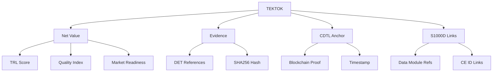

# Conceptos Clave

## S1000D - Especificación Internacional

S1000D es una especificación internacional para la producción de documentación técnica utilizando una Common Source Database (CSDB).

### Componentes Principales

#### Data Module (DM)
Unidad lógica autocontenida de información técnica que puede ser:
- **DES (Descriptivo)**: Información sobre sistemas, subsistemas y componentes
- **PRC (Procedimiento)**: Instrucciones paso a paso para tareas específicas  
- **FSC (Fallos)**: Información de diagnóstico y solución de problemas

#### Data Module Code (DMC)
Identificador único estructurado: `DMC-CAGE-DATAMODULETYPE-SYSTEMCODE-SUBSYSTEMCODE-ASSYCODE-DISASSYCODE-INFOCODE-ITEMLOCATIONCODE-A`

Ejemplo: `DMC-AQUA-A-56-10-20-00-000A-040A-A`

#### Information Set Name (ISN)  
Nombre del conjunto de información que agrupa múltiples Data Modules relacionados.

## UTCS-MI v5.0 - Identificación Universal

Sistema de identificación de 13 campos para trazabilidad completa:

```yaml
utcs_mi_v5_id: "EstándarUniversal:Documento-Genesis-S1000D-10.10-DescripcionSistema-0002-v1.0-TekniaTokens-GeneracionHumana-CROSS-AquaTechnologies-d34db33f-RestoDeVidaUtil"
```

### Estructura de Campos

1. **Estándar**: `EstándarUniversal`
2. **Tipo**: `Documento`  
3. **Dominio**: `Genesis-S1000D`
4. **Versión Esquema**: `10.10`
5. **Categoría Info**: `DescripcionSistema`
6. **Secuencial**: `0002`
7. **Versión Contenido**: `v1.0`
8. **Proyecto**: `TekniaTokens`
9. **Generación**: `GeneracionHumana`
10. **Clasificación**: `CROSS`
11. **Organización**: `AquaTechnologies`
12. **Hash**: `d34db33f`
13. **Ciclo Vida**: `RestoDeVidaUtil`

## Teknia Tokens - Gramática Económico-Técnica

### TEKTOK (Token de Conocimiento Técnico)
Unidad mínima de valor técnico verificable que incluye:

- **Net Value**: Métrica de valor neto (0.0-1.0)
- **Evidence**: Pruebas reproducibles (DET, SHA256)
- **CDTL Anchor**: Anclaje blockchain para inmutabilidad
- **Traceability**: Enlaces S1000D-Q

### Componentes TEKNIA



## Integración de Conceptos

### Flujo de Documentación

1. **Creación**: Autor crea Data Module con front-matter S1000D
2. **Validación**: Script verifica conformidad y metadatos UTCS-MI v5.0
3. **Registro DMRL**: Entrada automática en lista maestra
4. **Generación TEKTOK**: Conversión a token de valor si aplicable
5. **Publicación**: Ensamblado en IETP estático

### Trazabilidad Completa

```yaml
# Front-matter ejemplo
---
utcs_mi_v5_id: "EstándarUniversal:Documento-Genesis-S1000D-10.10..."
s1000d:
  schema_version: "5.0"
  dmc: "DMC-AQUA-A-56-10-20-00-000A-040A-A"
  language: "es-ES"
  issue: "001"
  security: "01"
tektok_ref: "TEKTOK-ATA-56-sistema-propulsion-0001"
---
```