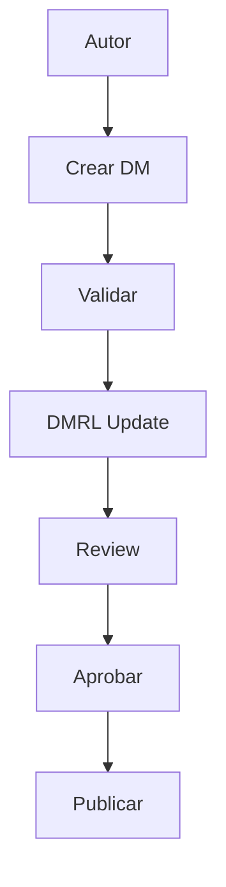

# 20 · CSDB (Repositorio fuente)

Common Source Database - Sistema de gestión centralizada para documentación S1000D.

## Contenido de la Sección

- **[Estructura y control](estructura-control.md)**: Organización del repositorio fuente
- **[Flujo de trabajo](flujo-trabajo.md)**: Procesos de creación y mantenimiento

## ¿Qué es la CSDB?

La Common Source Database es el repositorio centralizado que contiene:

- ✅ **Data Modules**: Todos los módulos de datos
- ✅ **Multimedia**: ICN e ilustraciones  
- ✅ **Metadatos**: Información de control
- ✅ **Configuración**: BREX y esquemas

## Implementación en MkDocs

Nuestra implementación CSDB utiliza:

- **Git**: Control de versiones
- **Markdown**: Formato de documentos
- **YAML**: Metadatos estructurados
- **CSV**: Listas maestras (DMRL)

## Flujo Simplificado

