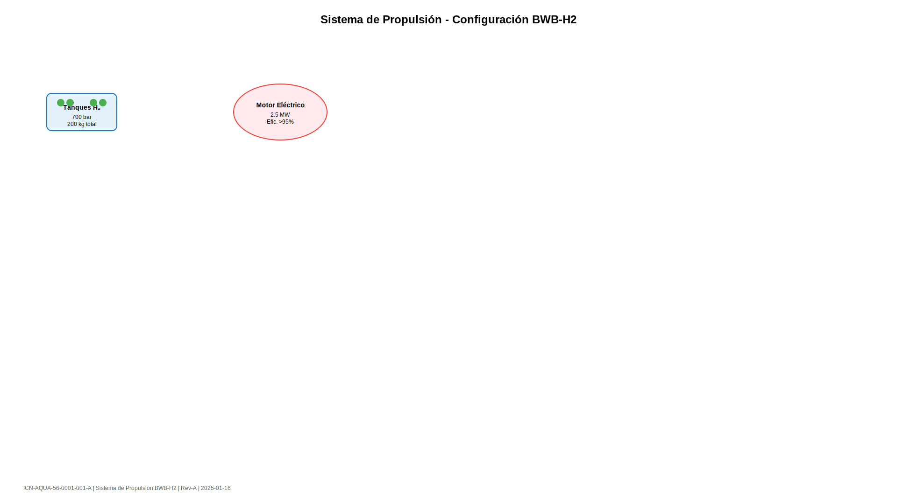

# ICN · Ilustraciones

Information Control Number para gestión de ilustraciones y multimedia.

## Estructura ICN

```
ICN-CAGE-SYSTEM-FIGURE-ITEM-VARIANT
```

## Componentes

- **CAGE**: Código de organización (2-5 chars)
- **SYSTEM**: Sistema ATA (2 dígitos)  
- **FIGURE**: Número de figura (4 dígitos)
- **ITEM**: Ítem dentro de figura (3 dígitos)
- **VARIANT**: Variante (1 letra)

## Ejemplos

### Ilustraciones Sistema Propulsión
```
ICN-AQUA-56-0001-001-A  # Diagrama general propulsión
ICN-AQUA-56-0001-002-A  # Detalle motor eléctrico
ICN-AQUA-56-0002-001-A  # Esquema celdas combustible
```

## Metadatos ICN

Cada archivo multimedia incluye metadatos:

```json
{
  "icn": "ICN-AQUA-56-0001-001-A",
  "title": "Diagrama Sistema Propulsión",
  "format": "SVG",
  "dimensions": "1920x1080",
  "security": "01",
  "created": "2025-01-16",
  "author": "Design Team",
  "checksum": "sha256:abc123..."
}
```

## Gestión de Assets

```
docs/_assets/
├── images/
│   ├── ICN-AQUA-56-0001-001-A.svg
│   ├── ICN-AQUA-56-0001-001-A.meta.json
│   └── ...
└── videos/
    ├── ICN-AQUA-56-0002-001-A.mp4
    └── ICN-AQUA-56-0002-001-A.meta.json
```

## Referenciado en Documentos

```markdown

*Figura 1: Sistema de propulsión principal (ICN-AQUA-56-0001-001-A)*
```