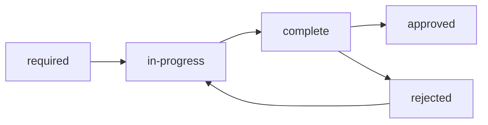

# DMRL · Descripción

La Data Module Requirements List (DMRL) es el documento de control maestro que define todos los módulos de datos requeridos para el proyecto.

## Propósito de la DMRL

La DMRL sirve como:

- ✅ **Registro maestro** de todos los módulos requeridos
- ✅ **Herramienta de planificación** para asignación de recursos  
- ✅ **Control de progreso** del desarrollo de documentación
- ✅ **Matriz de trazabilidad** entre requisitos y entregables

## Estructura de la DMRL

### Campos Principales

| Campo | Propósito | Ejemplo |
|-------|-----------|---------|
| **DMRL ID** | Identificador único | DMRL-0001 |
| **DMC** | Data Module Code | DMC-AQUA-A-56... |
| **Title** | Título descriptivo | "Sistema Propulsión" |
| **Type** | Tipo de módulo | DES/PRC/FSC |
| **Status** | Estado actual | required/in-progress/complete |
| **Priority** | Prioridad | critical/high/medium/low |

### Estados del Ciclo de Vida

## Gestión de la DMRL

### Creación de Entradas
1. **Identificar** necesidad de documentación
2. **Asignar** DMRL-ID único secuencial
3. **Generar** DMC siguiendo nomenclatura
4. **Completar** metadatos básicos
5. **Asignar** autor y fecha límite

### Actualización de Estados
- **Manual**: Edición directa del CSV
- **Automática**: Scripts de sincronización
- **Validada**: Verificación de consistencia

### Métricas y Reportes

La DMRL permite generar:
- Progreso por tipo de módulo
- Estado por sistema ATA
- Carga de trabajo por autor
- Fechas límite críticas

## Integración con Workflow

La DMRL se integra con:

- **Validación**: Scripts verifican referencias
- **CI/CD**: Automated status updates  
- **TEKTOK**: Enlaces a tokens de conocimiento
- **Git**: Trazabilidad de cambios