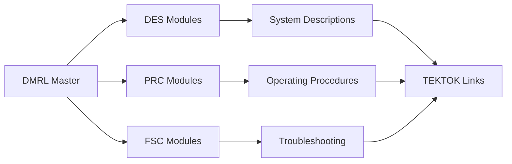

# 40 · DMRL (Lista de Requisitos de Módulos de Datos)

La Data Module Requirements List (DMRL) es el documento maestro que define todos los módulos de datos requeridos para un proyecto específico.

## Contenido de la Sección

- **[DMRL · Descripción](dmrl-descripcion.md)**: Explicación del propósito y estructura de la DMRL
- **[DMRL · Catálogo (CSV)](dmrl-catalogo.md)**: Acceso y gestión del catálogo maestro en formato CSV

## ¿Qué es la DMRL?

La DMRL es un registro centralizado que:

- ✅ **Define** todos los módulos de datos necesarios
- ✅ **Rastrea** el estado de desarrollo de cada módulo  
- ✅ **Asigna** responsabilidades y fechas límite
- ✅ **Vincula** con TEKTOKs cuando corresponde
- ✅ **Facilita** la planificación y seguimiento

## Estructura de la DMRL

## Estados de Módulos

| Estado | Descripción | Color | Acción Requerida |
|--------|-------------|-------|------------------|
| `required` | Módulo identificado pero no iniciado | 🔴 | Asignar autor |
| `in-progress` | En desarrollo activo | 🟡 | Seguimiento progreso |
| `complete` | Completado pendiente revisión | 🔵 | Revisión técnica |
| `approved` | Aprobado para uso | 🟢 | Ninguna |
| `rejected` | Rechazado, requiere retrabajo | 🟠 | Corrección |

## Integración con TEKNIA

La DMRL se integra con el sistema TEKNIA mediante:

- **Referencias TEKTOK**: Enlaces a tokens de conocimiento
- **Validación automática**: Scripts verifican consistencia
- **Métricas de progreso**: Dashboards de estado
- **Trazabilidad**: Conexión con UTCS-MI v5.0

## Métricas del Proyecto

Métricas actuales del proyecto basadas en DMRL:

- **Total módulos**: 10
- **Completados**: 1 (10%)
- **En progreso**: 3 (30%) 
- **Requeridos**: 6 (60%)
- **Criticidad alta**: 7 módulos