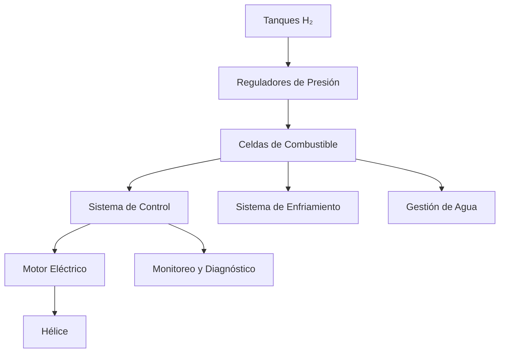

# Descripción Sistema Propulsión

## Introducción

Este módulo de datos describe el sistema de propulsión principal de la aeronave Q100-0001 con configuración BWB-H2 (Blended Wing Body con propulsión de hidrógeno).

## Propósito

El sistema de propulsión está diseñado para proporcionar el empuje necesario para todas las fases de vuelo, utilizando tecnología de celdas de combustible de hidrógeno para operación libre de emisiones.

## Descripción del Sistema

### Componentes Principales

#### Motor Principal
- **Tipo**: Motor eléctrico de alta eficiencia
- **Potencia nominal**: 2.5 MW
- **Alimentación**: Celdas de combustible de hidrógeno
- **Eficiencia**: >95%

#### Sistema de Celdas de Combustible
- **Tecnología**: PEM (Proton Exchange Membrane)
- **Potencia máxima**: 3.0 MW
- **Presión operación**: 350 bar
- **Temperatura operación**: 60-80°C

#### Tanques de Hidrógeno
- **Número de tanques**: 4
- **Capacidad total**: 200 kg H₂
- **Presión almacenamiento**: 700 bar
- **Material**: Fibra de carbono Tipo IV

### Arquitectura del Sistema

### Subsistemas

#### Sistema de Control y Monitoreo
- **Unidad de control**: FADEC (Full Authority Digital Engine Control)
- **Sensores**: Temperatura, presión, flujo, vibración
- **Interfaz**: Pantallas multifunción en cabina

#### Sistema de Enfriamiento
- **Tipo**: Enfriamiento líquido con radiadores
- **Fluido**: Glicol-agua 50/50
- **Temperatura objetivo**: 65°C ±5°C

#### Sistema de Gestión de Agua
- **Producción**: ~1.5 L/min a potencia nominal
- **Tratamiento**: Filtración y purificación
- **Almacenamiento**: Tanque de 50 L

## Especificaciones Técnicas

| Parámetro | Valor | Unidad |
|-----------|-------|--------|
| Potencia máxima | 2.5 | MW |
| Empuje máximo | 25,000 | N |
| Consumo H₂ nominal | 8.5 | kg/h |
| Autonomía | 4.5 | h |
| Peso total del sistema | 850 | kg |
| MTBF | 2,000 | h |

## Interfaces del Sistema

### Interfaces Eléctricas
- **Alimentación principal**: 800V DC desde celdas de combustible
- **Alimentación auxiliar**: 28V DC desde baterías
- **Comunicaciones**: CAN Bus, ARINC 429

### Interfaces Mecánicas
- **Montaje motor**: 4 puntos de anclaje
- **Conexión hélice**: Eje estriado estándar
- **Accesos mantenimiento**: Paneles desmontables

### Interfaces de Fluidos
- **Entrada H₂**: Conexión alta presión 700 bar
- **Salida agua**: Drenaje gravitacional
- **Enfriamiento**: Circuito cerrado

## Limitaciones Operacionales

### Condiciones Ambientales
- **Temperatura**: -40°C a +50°C
- **Humedad**: 0% a 95% RH
- **Altitud**: 0 a 12,000 m
- **Vibración**: Según DO-160G

### Limitaciones de Operación
- **Presión mínima H₂**: 50 bar
- **Temperatura máxima celdas**: 85°C
- **Máximo arranques/día**: 10

## Mantenimiento

### Inspecciones Programadas
- **Inspección A** (100 h): Verificación parámetros
- **Inspección B** (500 h): Revisión general
- **Inspección C** (2000 h): Overhaul parcial

### Componentes de Vida Limitada
- **Membrana celdas**: 8,000 h
- **Rodamientos motor**: 10,000 h
- **Válvulas H₂**: 5,000 ciclos

## Referencias

- ARP4754A: Guidelines for Development of Civil Aircraft and Systems
- DO-178C: Software Considerations in Airborne Systems and Equipment Certification
- SAE J2719: Hydrogen Fuel Quality Specifications

## Control de Cambios

| Versión | Fecha | Cambios | Autor |
|---------|-------|---------|-------|
| 001 | 2025-01-16 | Emisión inicial | Propulsion Team |

---

*Este documento es parte del sistema S1000D de Teknia Tokens y cumple con los requisitos UTCS-MI v5.0 de trazabilidad.*