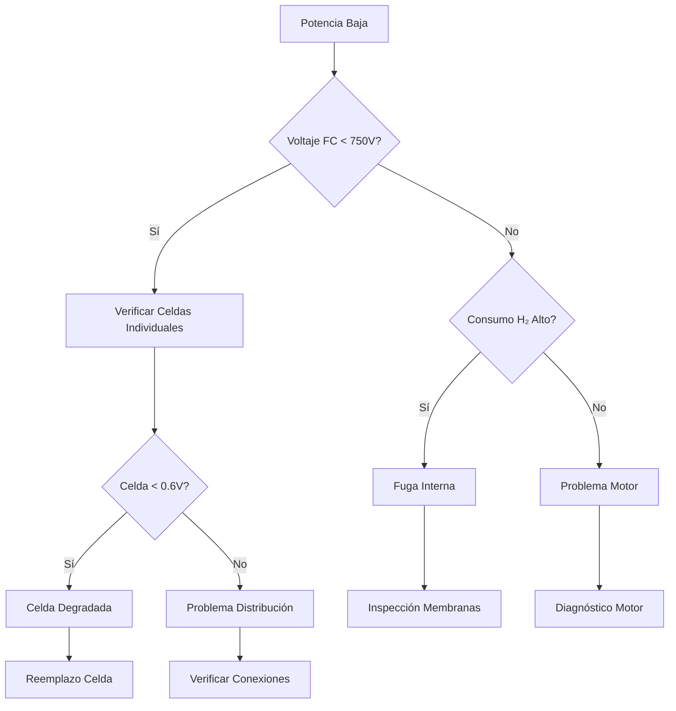

# Diagnóstico Fallos Sistema Propulsión

## Introducción

Este documento proporciona guías sistemáticas para el diagnóstico y solución de problemas del sistema de propulsión de hidrógeno.

## Códigos de Fallo del Sistema

### Categorías de Fallos

| Código | Categoría | Descripción | Severidad |
|--------|-----------|-------------|-----------|
| FC-xxx | Fuel Cell | Fallos en celdas de combustible | Alta |
| EM-xxx | Electric Motor | Fallos en motor eléctrico | Alta |
| H2-xxx | Hydrogen System | Fallos en sistema de hidrógeno | Crítica |
| CS-xxx | Control System | Fallos en sistema de control | Media |
| TH-xxx | Thermal | Fallos térmicos | Media |

## Tabla de Síntomas y Diagnóstico

### Problema 1: Motor No Arranca

**Síntomas:**
- Motor no responde a comando de arranque
- FADEC muestra "START INHIBIT"
- LED rojo en panel de control

**Posibles Causas:**

#### H2-001: Presión Baja de Hidrógeno

**Verificación:**
1. **Comprobar** presión tanques H₂:
   ```
   Presión normal: > 50 bar
   Presión crítica: < 20 bar
   ```

2. **Inspeccionar** indicadores:
   - Pantalla FADEC: "H2 PRESS LOW"
   - Manómetros locales en tanques
   - LED amarillo en panel H₂

**Acciones Correctivas:**
- [ ] Verificar válvulas de tanque abiertas
- [ ] Comprobar líneas de alimentación
- [ ] Inspeccionar reguladores de presión
- [ ] Si persistente: **Reemplazo tanques H₂**

#### FC-002: Fallo Inicialización Celdas

**Verificación:**
1. **Revisar** parámetros de celdas:
   - Voltaje salida: < 600V (normal > 750V)
   - Temperatura: fuera rango 60-80°C
   - Resistencia interna: > 0.5 Ω

2. **Diagnosticar** con tablet:
   ```bash
   # Comando diagnóstico
   fc_diag --full-check --cell-by-cell
   ```

**Acciones Correctivas:**
- [ ] Purga completa del sistema
- [ ] Verificar conexiones eléctricas
- [ ] Inspeccionar membranas PEM
- [ ] Si falla múltiples celdas: **Contactar fabricante**

#### EM-003: Fallo Motor Eléctrico

**Verificación:**
1. **Medir** resistencias devanados:
   - Fase A-B: 0.15 Ω ±5%
   - Fase B-C: 0.15 Ω ±5%
   - Fase C-A: 0.15 Ω ±5%

2. **Inspeccionar** rodamientos:
   - Ruido anómalo durante giro manual
   - Temperatura > 85°C tras operación
   - Vibración > 2.5 mm/s

**Acciones Correctivas:**
- [ ] Lubricación rodamientos
- [ ] Verificar alineación
- [ ] Inspeccionar devanados
- [ ] Si daño severo: **Reemplazo motor**

### Problema 2: Potencia Insuficiente

**Síntomas:**
- Motor arranca pero potencia < 80% nominal
- RPM inestables bajo carga
- Consumo H₂ elevado

#### FC-004: Degradación Celdas de Combustible

**Árbol de Diagnóstico:**



**Verificación Detallada:**
1. **Medir** cada celda individualmente:
   ```
   Celda nominal: 0.7-0.8V
   Celda degradada: < 0.6V
   Celda fallada: < 0.4V
   ```

2. **Analizar** curva I-V:
   - Pendiente normal: -0.5V/A
   - Pendiente alta: resistencia aumentada
   - No linealidad: fallo membrana

**Acciones Correctivas:**
- [ ] Reacondicionamiento celdas (protocolo RC-001)
- [ ] Reemplazo selectivo celdas degradadas
- [ ] Revisión sistema de humidificación
- [ ] Análisis gases de purga

### Problema 3: Sobrecalentamiento

**Síntomas:**
- Temperatura celdas > 85°C
- Activación ventiladores emergencia
- Reducción automática potencia

#### TH-005: Fallo Sistema Enfriamiento

**Diagnóstico Sistemático:**

1. **Verificar** flujo refrigerante:
   ```
   Flujo nominal: 15 L/min
   Presión sistema: 2-3 bar
   Temperatura entrada: ≤ 25°C
   ```

2. **Inspeccionar** radiadores:
   - Obstrucciones en aletas
   - Fugas en circuito
   - Funcionamiento ventiladores

3. **Comprobar** bomba refrigerante:
   - Presión salida: 2.5-3.0 bar
   - Consumo eléctrico: 150W ±10%
   - Ruido operación: normal

**Matriz de Fallos:**

| Síntoma | Causa Probable | Acción | Tiempo |
|---------|----------------|--------|---------|
| Flujo bajo | Bomba degradada | Reemplazo bomba | 2h |
| Temp. alta entrada | Radiador sucio | Limpieza radiadores | 1h |
| Presión baja | Fuga circuito | Localizar/reparar | 3-4h |
| No circulación | Bomba averiada | Reemplazo urgente | 1.5h |

### Problema 4: Alarmas de Sistema

#### CS-006: Fallos Sistema Control

**Códigos de Error FADEC:**

| Código | Descripción | Acción Inmediata |
|--------|-------------|------------------|
| E001 | Sensor temperatura | Verificar cableado |
| E002 | Sensor presión | Calibración sensor |
| E003 | Comunicación perdida | Reset sistema |
| E004 | Sobrecorriente | Inspeccionar motor |
| E005 | Fuga H₂ detectada | PARADA INMEDIATA |

**Procedimiento Diagnóstico E003:**
1. **Verificar** conexiones CAN Bus
2. **Comprobar** voltaje alimentación: 24-28V
3. **Reiniciar** controladores en secuencia:
   ```
   FADEC RESET → 30 seg
   Motor Controller RESET → 15 seg  
   FC Controller RESET → 45 seg
   ```

4. **Validar** comunicación:
   ```bash
   can_test --node-scan --timeout=5
   ```

## Herramientas de Diagnóstico

### Equipos Especializados

| Herramienta | Aplicación | Código Parte |
|-------------|------------|---------------|
| Analizador celdas FC | Diagnóstico individual celdas | ANA-FC-2000 |
| Osciloscopio | Análisis formas onda | OSC-TEK-5000 |
| Tablet diagnóstico | Interface FADEC | TAB-DIAG-PRO |
| Detector fugas H₂ | Seguridad operacional | DET-H2-ULTRA |

### Software de Diagnóstico

```bash
# Comandos principales
fc_diagnostics --comprehensive
motor_test --vibration --thermal
h2_system --leak-test --pressure-decay
```

## Procedimientos de Emergencia

### Fuga de Hidrógeno (Crítica)
1. **PARADA INMEDIATA** - Emergency stop
2. **Cerrar** válvulas H₂ principales  
3. **Activar** ventilación forzada
4. **Evacuar** área 50m radio
5. **NO REANUDAR** hasta inspección completa

### Sobrecalentamiento Crítico (>90°C)
1. **Reducir** potencia a idle
2. **Maximizar** enfriamiento
3. **Monitorear** 5 minutos
4. **Si persiste**: parada controlada
5. **Inspección** antes siguiente vuelo

## Repuestos Críticos

### Stock Mínimo Recomendado

| Componente | Cantidad | Tiempo Entrega |
|------------|----------|----------------|
| Celdas PEM individuales | 4 unidades | 7 días |
| Sensores temperatura | 6 unidades | 2 días |
| Válvulas H₂ | 2 unidades | 5 días |
| Controlador FADEC | 1 unidad | 14 días |

## Referencias Técnicas

- Manual Servicio Motor H2-2500: MSG-H2-2500-001
- Guía Seguridad Hidrógeno: SAE J2719
- Procedimientos Emergencia: PROC-EMER-H2-001

---

*Documento validado por equipo de ingeniería*  
*Próxima actualización: 2025-04-16*