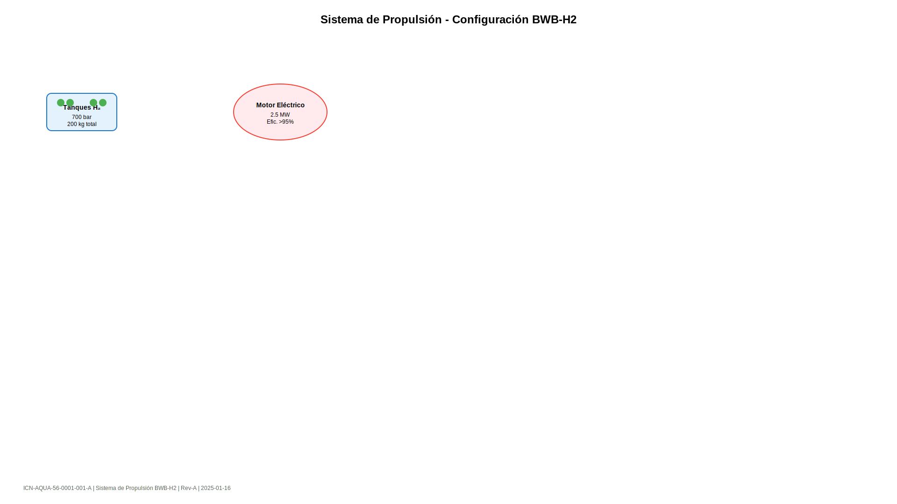

# 60 · Ilustraciones y Medios

Gestión de recursos multimedia con nomenclatura ICN y metadatos estructurados.

## Contenido de la Sección

- **[ICN y formatos](icn-formatos.md)**: Gestión de Information Control Numbers y formatos soportados

## Gestión de Assets

Los recursos multimedia se organizan en:

```
docs/_assets/
├── images/           # Ilustraciones estáticas
│   ├── *.svg        # Diagramas vectoriales
│   ├── *.png        # Imágenes rasterizadas  
│   └── *.meta.json  # Metadatos asociados
├── videos/          # Contenido audiovisual
└── 3d-models/       # Modelos tridimensionales
```

## Information Control Number (ICN)

Cada recurso multimedia tiene un ICN único:

```
ICN-CAGE-SYSTEM-FIGURE-ITEM-VARIANT
```

Ejemplo: `ICN-AQUA-56-0001-001-A`

## Metadatos de Recursos

Cada archivo incluye metadatos JSON:

```json
{
  "icn": "ICN-AQUA-56-0001-001-A",
  "title": "Diagrama Sistema Propulsión",
  "format": "SVG",
  "dimensions": "1920x1080",
  "security": "01",
  "created": "2025-01-16",
  "author": "Design Team",
  "checksum": "sha256:abc123...",
  "linked_dmc": ["DMC-AQUA-A-56-10-20-00-000A-040A-A"]
}
```

## Integración con Data Modules

Los recursos se referencian en módulos:

```markdown

*Figura 1: Sistema propulsión (ICN-AQUA-56-0001-001-A)*
```

## Formatos Soportados

- **SVG**: Diagramas vectoriales escalables
- **PNG**: Imágenes con transparencia
- **JPG**: Fotografías y capturas
- **MP4**: Videos instructivos
- **PDF**: Documentos técnicos