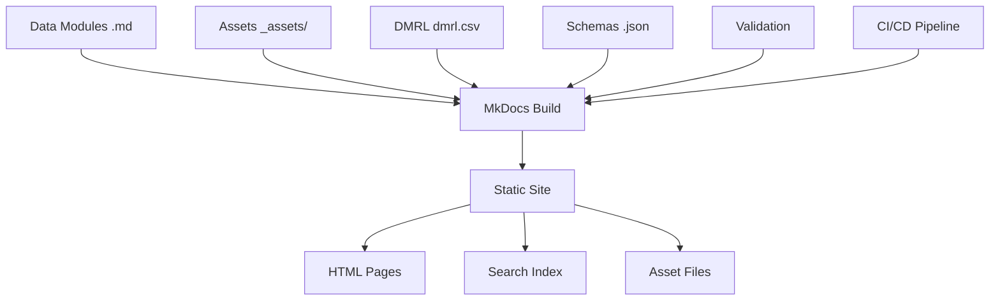

# 70 · Publicación (IETP estático)

Sistema de generación de Interactive Electronic Technical Publication estático basado en MkDocs.

## Contenido de la Sección

- **[Ensamblado y build](ensamblado-build.md)**: Proceso de construcción del sitio web

## ¿Qué es un IETP?

Una Interactive Electronic Technical Publication (IETP) es la versión electrónica interactiva de la documentación técnica que permite:

- ✅ **Navegación hipertextual** entre módulos relacionados
- ✅ **Búsqueda avanzada** por contenido y metadatos  
- ✅ **Visualización multimedia** integrada
- ✅ **Acceso multiplataforma** vía web browser

## Implementación con MkDocs

Nuestro IETP estático utiliza:

- **MkDocs**: Generador de sitios estáticos
- **Material Theme**: Interfaz moderna y responsive
- **Markdown**: Formato de contenido universal
- **Mermaid**: Diagramas interactivos
- **Search Plugin**: Búsqueda de texto completo

## Arquitectura del Sistema

## Características del IETP

### Navegación Estructurada
- Menú por secciones S1000D (00-90)
- Enlaces cruzados automáticos
- Breadcrumb navigation
- Tabla de contenidos por página

### Funcionalidades Interactivas
- Búsqueda de texto completo
- Filtrado por tipo de módulo
- Visualización de diagramas Mermaid
- Enlaces a recursos multimedia

### Accesibilidad
- Responsive design para móvil/tablet
- Soporte para lectores de pantalla
- Alto contraste opcional
- Navegación por teclado

## Despliegue

El IETP se puede desplegar en:

- **GitHub Pages**: Hosting gratuito integrado
- **Netlify/Vercel**: Servicios de hosting especializados
- **Servidor interno**: Para uso empresarial
- **CDN**: Distribución global optimizada