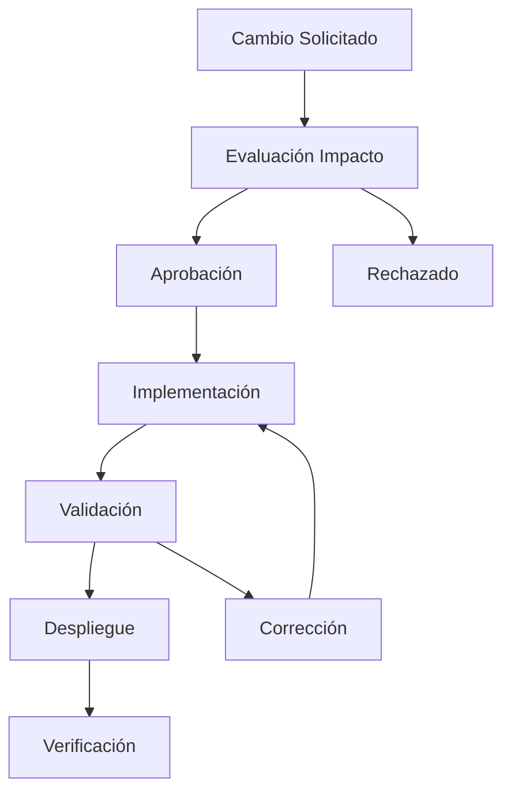

# 80 · Mantenimiento y Control de Cambios

Sistema de gestión de versiones y control de cambios para documentación S1000D.

## Contenido de la Sección

- **[Cambios y versionado](cambios-versionado.md)**: Gestión de versiones y control de cambios

## Filosofía de Mantenimiento

El mantenimiento del sistema se basa en:

- ✅ **Control de versiones**: Git para trazabilidad completa
- ✅ **Validación continua**: Scripts automáticos en cada cambio
- ✅ **Documentación viva**: Actualización incremental  
- ✅ **Calidad sostenida**: Revisiones regulares

## Tipos de Cambios

### Por Impacto
- **Minor**: Correcciones menores, typos
- **Major**: Cambios estructurales, nuevos módulos
- **Breaking**: Cambios incompatibles con versión anterior

### Por Origen
- **Correctivos**: Solución de errores identificados
- **Evolutivos**: Mejoras y nuevas funcionalidades
- **Adaptativos**: Cambios en requisitos externos
- **Preventivos**: Mejoras de mantenibilidad

## Proceso de Control

## Herramientas de Mantenimiento

- **Git**: Control de versiones distribuido
- **GitHub**: Colaboración y revisión
- **Scripts validación**: Calidad automática
- **DMRL tracking**: Seguimiento de progreso
- **Automated testing**: Verificación continua

## Métricas de Calidad

- Cobertura de validación: 100%
- Módulos sin referencias rotas: >95%  
- Tiempo medio de resolución: <48h
- Satisfacción usuarios: >4.5/5