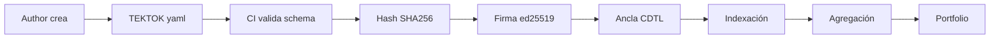

EstándarUniversal:Manifiesto-TEKNIA-TokenDeConocimiento-1.0-AQUA-GeneracionHybrida-CROSS-AmedeoPelliccia-7ea1d2c3-RestoDeVidaUtil

# TEKNIA — Technology Export Knowing Net Value Into Aggregation

**Definición oficial.**
**TEKNIA** es la gramática económico-técnica que convierte **conocimiento verificable** en **valor neto
agregable**, mediante **TEKTOKs** (notas mínimas de valor técnico) **selladas en CDTL** y **trazadas** con
evidencia reproducible (DET/S1000D-Q). TEKNIA **exporta tecnología**, prioriza el **saber contextualizado**,
mide **Net Value (anti-burbuja)** y **agrega** para habilitar carteras, pilotos e **IPO-pre-génesis**.

## 1) Propósito

* **Exportar** conocimiento listo para adopción (no silos).
* **Saber** con contexto: métricas, porqués y trazabilidad.
* **Valor neto**: descontar ruido y riesgo con evidencia reproducible.
* **Agregación**: de TEKTOKs a proyectos, portfolios y génesis financieras.

## 2) Principios (AQUA)

1. **Hash-only on-chain** (CDTL): pruebas, no datos sensibles.
2. **Reproducibilidad**: toda afirmación viene con DET y RTM.
3. **Anti-burbuja**: Net Value = métrica verificada × descuento de riesgo.
4. **Agregación con reglas**: sin duplicados, con sinergias acotadas y umbrales.
5. **Ética y cumplimiento**: GDPR/MiCA, licencias claras, auditoría abierta.

## 3) Campos mínimos de un TEKTOK (schema mínimo)

```yaml
tektok:
  id: "TEKTOK-<dominio>-<slug>-<nnnn>"
  title: "Nombre corto verificable"
  owner_org: "AQUA|Socio"
  authors: [{ name: "Nombre", id: "ORCID|Git" }]
  domain: "ATA-56|ATA-02|CQH|..."
  summary: >-
    Qué resuelve, base técnica, alcance y límites, en 4–6 líneas.
  links:
    ce_id: "CE-... (S1000D-Q)"
    dm_refs: ["docs/S1000D-Q/.../DM-ARCH.yaml"]
    repo_path: "ruta/al/artefacto.principal"
  effectivity:
    aircraft_sn: "Q100-0001"
    config: "BWB-H2"
    mod_state: "MS1"
  evidence:
    det_uris: ["events/DET-...json"]
    sha256: "64_hex_de_canonical"
    cdtl_anchor:
      network: "cdtl-main-sandbox"
      tx_id: "0x..."
      block_hash: "0x..."
      height: 1234
  net_value:
    inputs:
      trl: 1..9
      quality: 0.0..1.0
      energy_saving_pct: 0..100
      co2e_avoided_kg_per_unit: 0..N
      market_readiness: 0.0..1.0
      risk_discount: 0.0..0.5
    weights:
      trl: 0.30
      quality: 0.20
      energy: 0.20
      market: 0.15
      co2e: 0.15
    score: 0.0..1.0
  circularity:
    repairability: 0.0..1.0
    recycled_content_pct: 0..100
    reuse_rate_pct: 0..100
    greenscore: 0.0..1.0
  rights:
    license: "CC-BY-4.0|Apache-2.0|Propietaria"
    usage: "Investigación|Comercial|Mixta"
  rie:
    events: ["Zenodo DOI","PR aceptado","Estándar/SC","MoU piloto"]
  date_issued: "2025-01-16T10:00:00Z"
  signature: "ed25519:base64"
```

## 4) Flujo de procesamiento



## 5) Ejemplos de TEKTOKs

### 5.1) TEKTOK de arquitectura BWB

```yaml
tektok:
  id: "TEKTOK-AAA-bwb-arch-0001"
  title: "BWB Structural Architecture Baseline"
  owner_org: "AQUA"
  domain: "ATA-53"
  summary: >-
    Arquitectura estructural del BWB H2-Q100 con 15% menos peso
    que diseños convencionales, mediante optimización topológica
    cuántica y CFRP avanzado.
  net_value:
    inputs:
      trl: 7
      quality: 0.85
      energy_saving_pct: 15
    score: 0.72
```

### 5.2) TEKTOK de sistema criogénico

```yaml
tektok:
  id: "TEKTOK-CQH-cryo-tank-0042"
  title: "Zero Boil-off H2 Tank Design"
  domain: "ATA-28"
  summary: >-
    Tanque criogénico con ZBO mediante recirculación activa
    y aislamiento multicapa, logrando 96h de autonomía.
```

## 6) Agregación y Portfolio

Los TEKTOKs se agregan en:
- **Proyectos**: conjunto coherente de TEKTOKs para un objetivo
- **Carteras**: múltiples proyectos con sinergias
- **IPO-pre-génesis**: valoración basada en Net Value agregado

## 7) Integración con AMPEL360

TEKNIA alimenta el **RIE360** (Repositorio de Ingeniería Extendida) de AMPEL360:
- TEKTOKs → RIE Events
- Net Value → ARIA Dashboards
- CDTL anchors → QAUDIT

## 8) Gobernanza

- **Comité Técnico**: valida calidad y TRL
- **Auditoría**: verificación de evidencias DET
- **Ética**: cumplimiento GDPR/MiCA
- **Tokenomics**: futuro modelo de incentivos (post-R1)

---

*TEKNIA R1 — Enero 2025 — AQUA Framework*